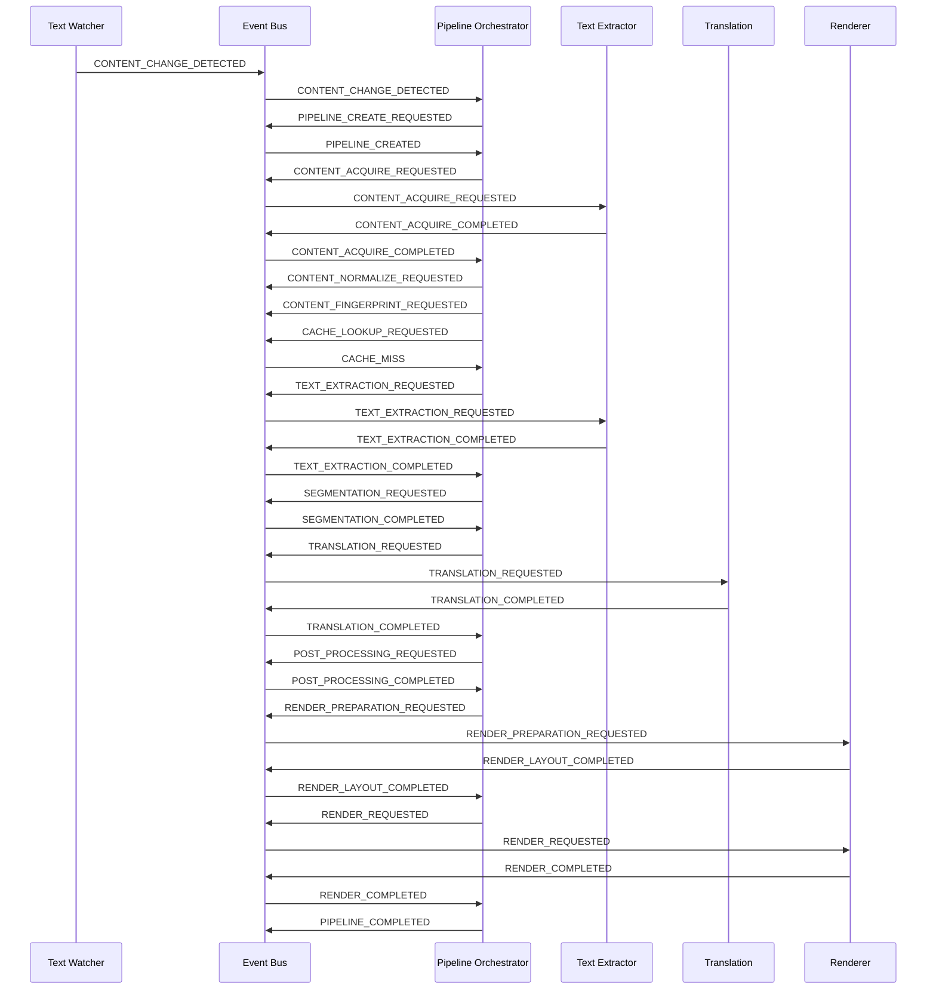
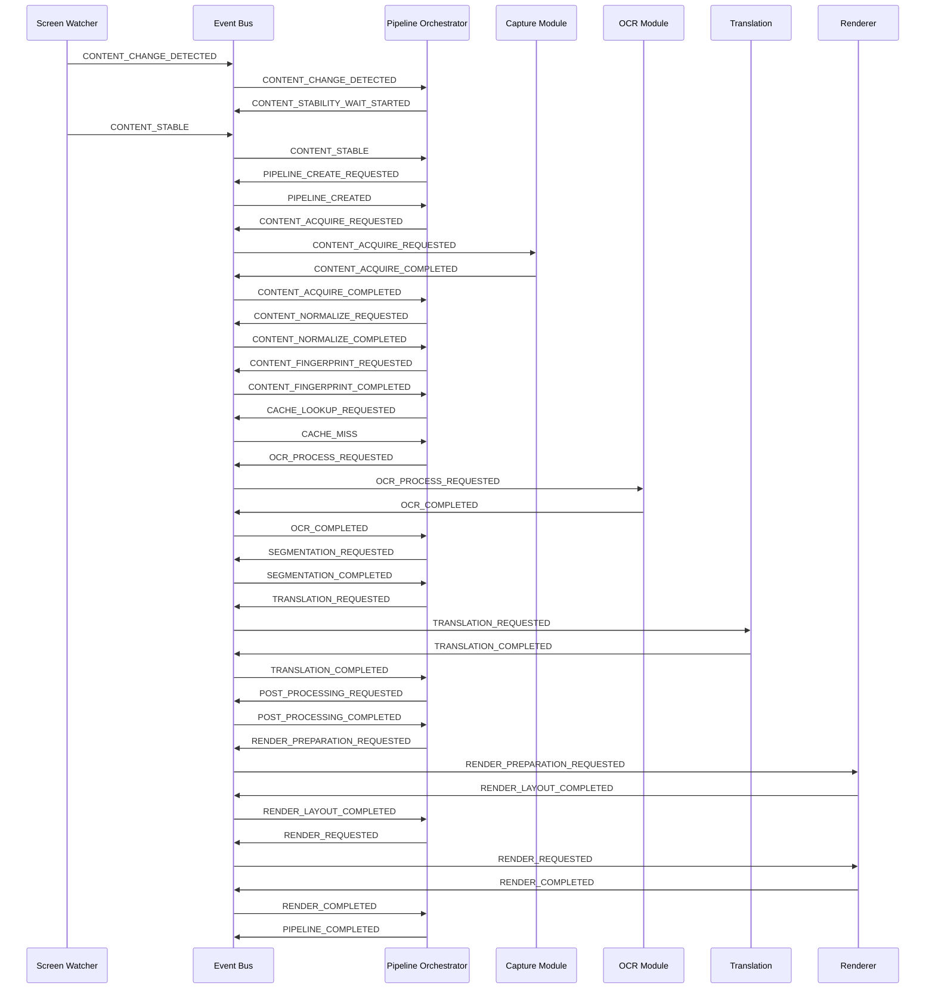
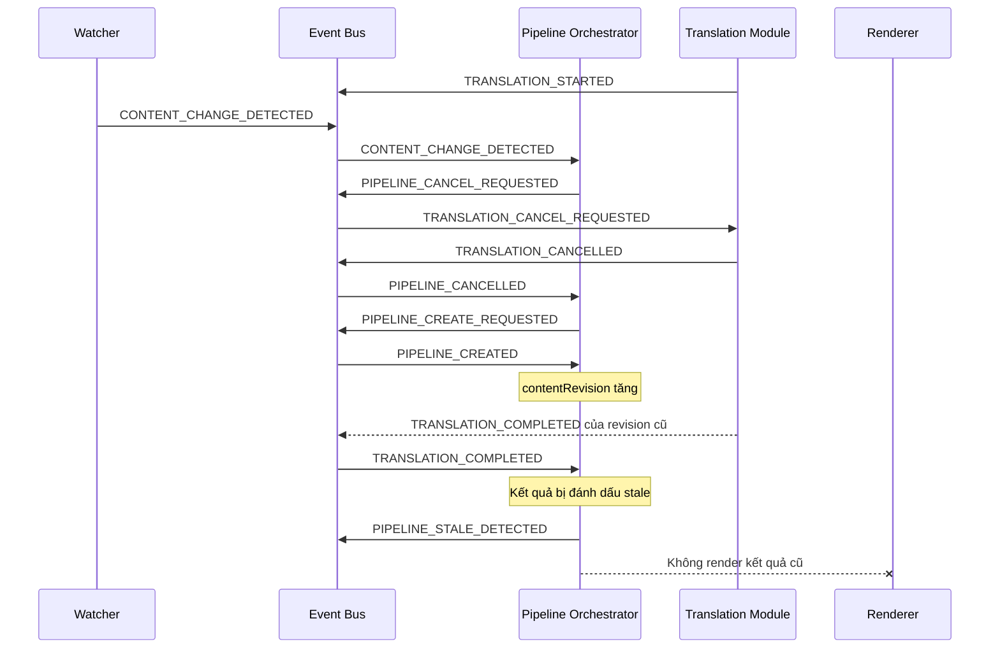
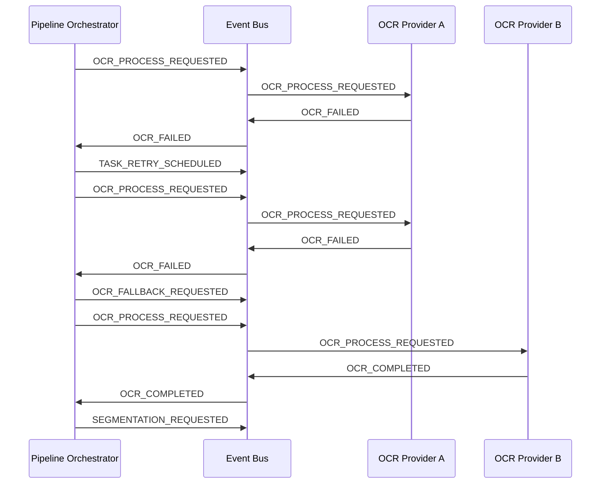

# CRAI Event Bus

Version: 0.1
Status: Draft
Document Type: Architecture
Path: `docs/architecture/EVENT_BUS.md`

---

## 1. Mục đích

Tài liệu này định nghĩa cơ chế giao tiếp dựa trên sự kiện trong CRAI.

Event Bus được sử dụng để:

* tách rời các module
* truyền tín hiệu giữa các bước xử lý
* điều phối reading session
* điều phối processing pipeline
* đồng bộ state machine
* hỗ trợ cancellation
* hỗ trợ retry và fallback
* theo dõi tiến trình xử lý
* giảm phụ thuộc trực tiếp giữa các module
* hỗ trợ logging, metrics và tracing

Ví dụ luồng xử lý:

```text
Watcher
    ↓ emits
CONTENT_CHANGE_DETECTED
    ↓
Session Orchestrator
    ↓ emits
PIPELINE_CREATE_REQUESTED
    ↓
Pipeline Orchestrator
    ↓ emits
CONTENT_ACQUIRE_REQUESTED
```

Các module không nên tự gọi trực tiếp toàn bộ chuỗi:

```text
Watcher → Capture → OCR → Translation → Renderer
```

Thay vào đó, việc điều phối phải đi qua event và orchestrator tương ứng.

---

## 2. Phạm vi

Tài liệu này định nghĩa:

1. Vai trò của Event Bus
2. Loại event
3. Event envelope
4. Quy ước đặt tên
5. Quy tắc publish và subscribe
6. Event theo application
7. Event theo reading session
8. Event theo processing pipeline
9. Event cho OCR
10. Event cho translation
11. Event cho render
12. Event cho retry, fallback và cancellation
13. Event ordering
14. Event deduplication
15. Error handling
16. Logging và observability
17. Event versioning
18. Event Bus cho MVP

Tài liệu này không định nghĩa chi tiết:

* implementation của Event Bus
* framework hoặc thư viện cụ thể
* API của OCR provider
* API của translation provider
* cấu trúc database
* UI component cụ thể

---

# 3. Nguyên tắc thiết kế

## 3.1 Event là thông báo về điều đã xảy ra

Event nên diễn đạt một sự việc đã xảy ra.

Ví dụ đúng:

```text
CONTENT_CHANGED
OCR_COMPLETED
TRANSLATION_FAILED
SESSION_PAUSED
```

Không nên sử dụng event như một lời gọi hàm mơ hồ.

Ví dụ không tốt:

```text
DO_OCR
RUN_TRANSLATION
CALL_RENDERER
```

Tuy nhiên, CRAI vẫn cần các event dạng yêu cầu để điều phối tác vụ bất đồng bộ.

Do đó hệ thống phân biệt rõ:

```text
Command Event
Domain Event
Result Event
System Event
```

---

## 3.2 Event không trực tiếp thay đổi state

Event chỉ là đầu vào cho state machine.

Ví dụ:

```text
Event:
OCR_COMPLETED

State transition:
OCR_PROCESSING → SEGMENTING
```

Event handler không được tự ý sửa state bằng cách gán trực tiếp.

Không hợp lệ:

```text
pipeline.state = "SEGMENTING"
```

Hợp lệ:

```text
stateTransitionService.transition({
  entityId: pipelineId,
  event: "OCR_COMPLETED",
  expectedState: "OCR_PROCESSING",
  nextState: "SEGMENTING"
})
```

---

## 3.3 Module phát event không cần biết consumer

Ví dụ:

```text
OCR Module
    ↓ emits
OCR_COMPLETED
```

OCR Module không cần biết:

* Segmentation Module có tồn tại hay không
* UI có đang theo dõi tiến trình hay không
* Metrics có ghi nhận event hay không
* Cache có lưu OCR result hay không

Các consumer tự đăng ký event phù hợp.

---

## 3.4 Event phải có đủ context

Mọi event thuộc reading session hoặc processing pipeline phải mang tối thiểu các identifier phù hợp:

```text
sessionId
pipelineId
contentRevision
correlationId
```

Nhờ đó hệ thống có thể:

* chống stale result
* trace toàn bộ pipeline
* phân biệt nhiều session
* bỏ qua event cũ
* xử lý cancellation chính xác

---

## 3.5 Không truyền dữ liệu lớn không cần thiết

Event không nên luôn chứa toàn bộ:

* ảnh màn hình
* document lớn
* model result lớn
* nội dung truyện dài

Đối với dữ liệu lớn, event nên mang reference:

```text
artifactRef
contentRef
imageBufferRef
temporaryFileRef
cacheKey
```

Trong cùng process, implementation có thể sử dụng memory reference nội bộ.

Nếu về sau tách process, reference phải có thể truy xuất qua storage hoặc IPC.

---

## 3.6 Event handler phải ngắn và có trách nhiệm rõ ràng

Event handler không nên xử lý toàn bộ pipeline.

Handler chỉ nên:

* kiểm tra event
* kiểm tra state
* xác nhận revision
* gọi một use case hoặc service phù hợp
* phát result event
* ghi log cần thiết

Không nên:

```text
CONTENT_CHANGED handler
    → capture
    → OCR
    → translate
    → render
```

---

## 3.7 Event handler phải có khả năng bỏ qua event

Event có thể bị bỏ qua nếu:

* session đã dừng
* pipeline đã bị hủy
* content revision đã cũ
* state hiện tại không chấp nhận event
* event đã được xử lý
* source không còn hợp lệ

Bỏ qua event stale không được xem là application error.

---

# 4. Vai trò của Event Bus trong kiến trúc

Event Bus là lớp giao tiếp nội bộ.

```text
Source Adapter
Watcher
Capture
OCR
Translation
Renderer
Cache
UI
Session Manager
Pipeline Orchestrator
        │
        └── Event Bus
```

Event Bus không thay thế toàn bộ lời gọi hàm.

Có thể gọi trực tiếp khi:

* thao tác nội bộ trong cùng module
* đọc repository
* gọi utility thuần túy
* validate dữ liệu
* thực hiện tính toán đồng bộ
* gọi dependency theo interface rõ ràng

Nên dùng event khi:

* giao tiếp giữa module
* tác vụ bất đồng bộ
* phát thông báo trạng thái
* một event có nhiều consumer
* cần cancellation hoặc retry
* cần tracking toàn pipeline
* cần tách producer khỏi consumer

---

# 5. Thành phần kiến trúc

## 5.1 Event Publisher

Phát event vào Event Bus.

Ví dụ:

```text
Screen Watcher
OCR Engine
Translation Engine
Session Manager
Pipeline Orchestrator
Renderer
```

---

## 5.2 Event Subscriber

Đăng ký nhận một hoặc nhiều event.

Ví dụ:

```text
Pipeline Orchestrator subscribes CONTENT_STABLE
UI subscribes PIPELINE_PROGRESS_CHANGED
Metrics subscribes OCR_COMPLETED
Cache subscribes TRANSLATION_COMPLETED
```

---

## 5.3 Event Dispatcher

Có trách nhiệm:

* nhận event
* validate envelope
* tìm subscriber
* chuyển event đến handler
* cô lập lỗi handler
* ghi nhận thời gian xử lý
* hỗ trợ unsubscribe
* hỗ trợ cancellation nếu implementation cho phép

---

## 5.4 Event Registry

Lưu danh sách event được hệ thống chấp nhận.

Mỗi event nên có:

```text
eventName
eventVersion
eventCategory
payloadSchema
producer
consumer
deliveryMode
orderingRequirement
```

Event Registry giúp tránh:

* tên event trùng
* payload không nhất quán
* sử dụng event chưa khai báo
* thay đổi schema không kiểm soát

---

## 5.5 Event Middleware

Middleware có thể xử lý:

* logging
* tracing
* metrics
* validation
* deduplication
* permission
* stale-result check
* error boundary
* performance profiling

---

# 6. Phân loại event

## 6.1 Command Event

Thể hiện yêu cầu thực hiện một hành động.

Quy ước hậu tố:

```text
_REQUESTED
```

Ví dụ:

```text
SESSION_START_REQUESTED
CONTENT_CAPTURE_REQUESTED
OCR_PROCESS_REQUESTED
TRANSLATION_REQUESTED
PIPELINE_CANCEL_REQUESTED
```

Command Event thường có một consumer chính.

---

## 6.2 Domain Event

Thông báo một thay đổi có ý nghĩa trong domain.

Ví dụ:

```text
SESSION_STARTED
CONTENT_CHANGED
SOURCE_STABLE
REGION_CHANGED
PROVIDER_CHANGED
```

Domain Event có thể có nhiều consumer.

---

## 6.3 Result Event

Thông báo kết quả của một tác vụ.

Quy ước hậu tố:

```text
_COMPLETED
_FAILED
_SKIPPED
_CANCELLED
```

Ví dụ:

```text
OCR_COMPLETED
OCR_FAILED
TRANSLATION_COMPLETED
RENDER_COMPLETED
PIPELINE_CANCELLED
```

---

## 6.4 Progress Event

Thông báo tiến trình nhưng không làm thay đổi stage chính.

Quy ước:

```text
_PROGRESS_CHANGED
```

Ví dụ:

```text
OCR_PROGRESS_CHANGED
TRANSLATION_PROGRESS_CHANGED
PIPELINE_PROGRESS_CHANGED
```

Progress Event có thể bị throttle hoặc drop nếu event đến quá nhanh.

---

## 6.5 System Event

Phản ánh trạng thái của application hoặc runtime.

Ví dụ:

```text
APPLICATION_STARTED
APPLICATION_SUSPENDED
NETWORK_STATUS_CHANGED
RESOURCE_PRESSURE_DETECTED
SCREEN_CAPTURE_PERMISSION_CHANGED
```

---

# 7. Event Envelope

Mọi event phải sử dụng một envelope thống nhất.

Ví dụ khái niệm:

```ts
interface EventEnvelope<TPayload> {
  eventId: string;
  eventName: string;
  eventVersion: number;

  occurredAt: string;
  publishedAt: string;

  sourceModule: string;

  correlationId: string;
  causationId?: string;

  applicationInstanceId: string;

  sessionId?: string;
  pipelineId?: string;
  taskId?: string;
  contentRevision?: number;

  priority?: EventPriority;
  payload: TPayload;

  metadata?: Record<string, unknown>;
}
```

---

## 7.1 `eventId`

Identifier duy nhất của event.

Dùng để:

* deduplicate
* tracing
* debug
* kiểm tra event đã xử lý chưa

Ví dụ:

```text
evt_01JCRAI8X2K5
```

---

## 7.2 `eventName`

Tên event theo registry.

Ví dụ:

```text
OCR_COMPLETED
```

---

## 7.3 `eventVersion`

Phiên bản schema của event.

Ví dụ:

```text
1
```

Khi payload thay đổi không tương thích, tăng version.

---

## 7.4 `occurredAt`

Thời điểm sự việc thực tế xảy ra.

Ví dụ OCR hoàn thành lúc nào.

---

## 7.5 `publishedAt`

Thời điểm event được đưa lên Event Bus.

Thông thường gần với `occurredAt`, nhưng có thể khác nếu:

* event được buffer
* event được retry
* event được khôi phục
* event được phát sau khi ghi storage

---

## 7.6 `sourceModule`

Module phát event.

Ví dụ:

```text
screen-watcher
ocr-engine
translation-engine
session-manager
pipeline-orchestrator
```

---

## 7.7 `correlationId`

Identifier liên kết toàn bộ hành trình xử lý.

Một pipeline thường dùng chung một `correlationId`.

Ví dụ:

```text
CONTENT_CHANGED
CONTENT_CAPTURE_REQUESTED
CONTENT_CAPTURED
OCR_PROCESS_REQUESTED
OCR_COMPLETED
TRANSLATION_COMPLETED
RENDER_COMPLETED
```

đều có cùng `correlationId`.

---

## 7.8 `causationId`

`eventId` của event trực tiếp gây ra event hiện tại.

Ví dụ:

```text
CONTENT_CHANGED
eventId = evt-001
```

gây ra:

```text
PIPELINE_CREATE_REQUESTED
causationId = evt-001
```

---

## 7.9 `applicationInstanceId`

Phân biệt các lần chạy ứng dụng.

Điều này giúp tránh xử lý event từ runtime cũ sau khi application restart.

---

## 7.10 `sessionId`

Bắt buộc với event liên quan đến reading session.

---

## 7.11 `pipelineId`

Bắt buộc với event liên quan đến processing pipeline.

---

## 7.12 `taskId`

Identifier của một tác vụ cụ thể.

Ví dụ:

```text
captureTaskId
ocrTaskId
translationTaskId
renderTaskId
```

---

## 7.13 `contentRevision`

Bắt buộc với event liên quan đến nội dung.

Event có revision cũ hơn revision hiện tại phải được xem là stale.

---

## 7.14 `priority`

Mức ưu tiên của event.

Đề xuất:

```text
CRITICAL
HIGH
NORMAL
LOW
```

Ví dụ:

```text
APPLICATION_SHUTDOWN_REQUESTED → CRITICAL
PIPELINE_CANCEL_REQUESTED → HIGH
CONTENT_CHANGED → NORMAL
OCR_PROGRESS_CHANGED → LOW
```

---

## 7.15 `payload`

Dữ liệu riêng của event.

Payload phải:

* có schema rõ ràng
* không chứa secret
* không chứa dữ liệu dư thừa
* không thay đổi sau khi publish

---

## 7.16 `metadata`

Dữ liệu bổ sung không thuộc domain chính.

Ví dụ:

```text
trace flags
debug information
runtime platform
provider latency
feature flag
```

Không nên dựa vào metadata để thực hiện logic nghiệp vụ bắt buộc.

---

# 8. Quy ước đặt tên event

Tên event sử dụng:

```text
UPPER_SNAKE_CASE
```

Cấu trúc khuyến nghị:

```text
<SUBJECT>_<ACTION>_<STATUS>
```

Ví dụ:

```text
SESSION_START_REQUESTED
SESSION_STARTED
CONTENT_CAPTURE_REQUESTED
CONTENT_CAPTURE_COMPLETED
OCR_PROCESS_REQUESTED
OCR_COMPLETED
TRANSLATION_FAILED
```

---

## 8.1 Event yêu cầu

```text
*_REQUESTED
```

Ví dụ:

```text
APPLICATION_SHUTDOWN_REQUESTED
SESSION_CREATE_REQUESTED
PIPELINE_CANCEL_REQUESTED
```

---

## 8.2 Event bắt đầu

```text
*_STARTED
```

Ví dụ:

```text
SESSION_STARTED
OCR_STARTED
TRANSLATION_STARTED
```

Không bắt buộc mọi tác vụ đều phát event `STARTED`.

Chỉ nên phát nếu event này hữu ích cho:

* state transition
* UI progress
* metrics
* timeout tracking

---

## 8.3 Event hoàn thành

```text
*_COMPLETED
```

Ví dụ:

```text
CONTENT_CAPTURE_COMPLETED
OCR_COMPLETED
TRANSLATION_COMPLETED
RENDER_COMPLETED
```

---

## 8.4 Event thất bại

```text
*_FAILED
```

Ví dụ:

```text
OCR_FAILED
TRANSLATION_FAILED
RENDER_FAILED
```

Payload phải chứa error classification.

---

## 8.5 Event bị bỏ qua

```text
*_SKIPPED
```

Ví dụ:

```text
OCR_SKIPPED
TRANSLATION_SKIPPED
PIPELINE_SKIPPED
```

`SKIPPED` không phải lỗi.

---

## 8.6 Event bị hủy

```text
*_CANCEL_REQUESTED
*_CANCELLED
```

Ví dụ:

```text
PIPELINE_CANCEL_REQUESTED
PIPELINE_CANCELLED
OCR_CANCELLED
```

---

## 8.7 Event thay đổi

```text
*_CHANGED
```

Ví dụ:

```text
CONTENT_CHANGED
REGION_CHANGED
PROVIDER_CHANGED
NETWORK_STATUS_CHANGED
```

---

# 9. Delivery Model

## 9.1 In-process delivery

Trong MVP, Event Bus có thể chạy hoàn toàn trong application process.

Ưu điểm:

* đơn giản
* nhanh
* không cần broker
* dễ debug
* phù hợp desktop application
* ít tài nguyên

Luồng:

```text
Publisher
    ↓
In-memory Event Bus
    ↓
Subscriber
```

---

## 9.2 Inter-process delivery

Nếu CRAI tách thành nhiều process:

```text
UI Process
Core Process
OCR Worker
Capture Worker
```

Event Bus có thể cần sử dụng:

* IPC
* local socket
* named pipe
* worker channel
* process messaging

Event envelope không nên phụ thuộc vào in-memory object không serialize được.

---

## 9.3 Persistent delivery

Phần lớn event runtime của CRAI không cần lưu bền vững.

Ví dụ không cần persist:

```text
OCR_PROGRESS_CHANGED
SCREEN_FRAME_CHANGED
RENDER_STARTED
```

Một số event hoặc state có thể cần persist gián tiếp:

```text
SESSION_CONFIGURATION_CHANGED
SESSION_STOPPED
TRANSLATION_USER_EDITED
GLOSSARY_ENTRY_UPDATED
```

Việc persist nên do module storage xử lý, không phải Event Bus tự lưu mọi event.

---

# 10. Delivery Semantics

Đối với MVP, delivery semantic đề xuất là:

```text
At-most-once trong cùng process
```

Tuy nhiên handler vẫn nên có khả năng idempotent khi phù hợp.

Nếu về sau dùng IPC hoặc message broker, hệ thống có thể chuyển sang:

```text
At-least-once
```

Khi đó bắt buộc có:

* event deduplication
* idempotent handlers
* processed event tracking cho event quan trọng

---

# 11. Event Ordering

## 11.1 Ordering theo session

Event trong cùng một session phải được xử lý theo thứ tự hợp lý.

Ví dụ:

```text
SESSION_STARTED
CONTENT_CHANGED
PIPELINE_CREATED
SESSION_STOPPED
```

Không được xử lý `CONTENT_CHANGED` sau `SESSION_STOPPED`.

---

## 11.2 Ordering theo pipeline

Event của cùng một pipeline phải tôn trọng state machine.

Ví dụ hợp lệ:

```text
OCR_STARTED
OCR_COMPLETED
TRANSLATION_STARTED
```

Ví dụ không hợp lệ:

```text
TRANSLATION_STARTED
OCR_COMPLETED
```

trừ trường hợp pipeline không cần OCR.

---

## 11.3 Không yêu cầu global ordering

Không cần đảm bảo event giữa các session khác nhau có thứ tự toàn cục.

Ví dụ:

```text
Session A: OCR_COMPLETED
Session B: CONTENT_CHANGED
```

có thể được xử lý song song.

---

## 11.4 Sequence Number

Có thể bổ sung:

```text
sessionSequence
pipelineSequence
```

Ví dụ:

```ts
sessionSequence: 27
pipelineSequence: 8
```

Dùng để phát hiện:

* event đến trễ
* event sai thứ tự
* event bị thiếu

Trong MVP, `contentRevision` và state validation có thể đã đủ.

---

# 12. Event Validation

Trước khi dispatch, Event Bus phải kiểm tra:

```text
eventId tồn tại
eventName đã đăng ký
eventVersion được hỗ trợ
occurredAt hợp lệ
sourceModule tồn tại
payload đúng schema
identifier bắt buộc tồn tại
```

Đối với pipeline event:

```text
sessionId tồn tại
pipelineId tồn tại
contentRevision tồn tại
correlationId tồn tại
```

Event không hợp lệ phải:

* bị từ chối
* được ghi log
* tăng invalid event metric
* không làm crash application

---

# 13. Subscriber Failure Isolation

Một subscriber thất bại không được ngăn subscriber khác nhận event.

Ví dụ:

```text
OCR_COMPLETED
    ├── Pipeline Orchestrator
    ├── Cache
    ├── Metrics
    └── UI Progress
```

Nếu Metrics handler lỗi, Pipeline Orchestrator vẫn phải được xử lý.

Event Dispatcher cần:

* cô lập từng handler
* bắt exception
* ghi subscriber name
* áp dụng timeout nếu cần
* không propagate lỗi không kiểm soát

---

# 14. Application Events

## 14.1 Lifecycle Events

```text
APPLICATION_START_REQUESTED
APPLICATION_STARTED
APPLICATION_INITIALIZATION_STARTED
APPLICATION_READY
APPLICATION_BACKGROUND_ENTERED
APPLICATION_FOREGROUND_ENTERED
APPLICATION_SUSPEND_REQUESTED
APPLICATION_SUSPENDED
APPLICATION_RESUME_REQUESTED
APPLICATION_RESUMED
APPLICATION_SHUTDOWN_REQUESTED
APPLICATION_SHUTTING_DOWN
APPLICATION_TERMINATED
APPLICATION_FATAL_ERROR_OCCURRED
```

---

## 14.2 `APPLICATION_READY`

Phát khi các capability tối thiểu đã sẵn sàng.

Payload đề xuất:

```ts
interface ApplicationReadyPayload {
  availableCapabilities: string[];
  degradedCapabilities: string[];
  unavailableCapabilities: string[];
  restoredSessionCount: number;
}
```

---

## 14.3 `APPLICATION_FATAL_ERROR_OCCURRED`

Payload đề xuất:

```ts
interface ApplicationFatalErrorPayload {
  errorCode: string;
  message: string;
  failedModule?: string;
  recoverable: boolean;
}
```

Không chứa:

```text
API key
access token
nội dung truyện
ảnh chụp màn hình
```

---

# 15. Session Events

## 15.1 Session lifecycle

```text
SESSION_CREATE_REQUESTED
SESSION_CREATED
SESSION_CONFIGURE_REQUESTED
SESSION_CONFIGURATION_CHANGED
SESSION_READY
SESSION_START_REQUESTED
SESSION_STARTED
SESSION_PAUSE_REQUESTED
SESSION_PAUSED
SESSION_RESUME_REQUESTED
SESSION_RESUMED
SESSION_STOP_REQUESTED
SESSION_STOPPING
SESSION_STOPPED
SESSION_ERROR_OCCURRED
SESSION_RECOVERY_REQUESTED
SESSION_RECOVERED
SESSION_RECOVERY_FAILED
```

---

## 15.2 `SESSION_CREATE_REQUESTED`

Payload:

```ts
interface SessionCreateRequestedPayload {
  sessionType:
    | "TEXT_READING"
    | "IMAGE_READING"
    | "MANUAL_IMAGE"
    | "CLIPBOARD"
    | "DOCUMENT";

  sourceType: string;
  initialConfiguration?: Record<string, unknown>;
}
```

---

## 15.3 `SESSION_CREATED`

Payload:

```ts
interface SessionCreatedPayload {
  sessionType: string;
  sourceType: string;
  createdAt: string;
}
```

Event envelope phải có `sessionId`.

---

## 15.4 `SESSION_CONFIGURATION_CHANGED`

Payload có thể bao gồm các trường đã thay đổi:

```ts
interface SessionConfigurationChangedPayload {
  changedFields: string[];
  configurationVersion: number;
  requiresPipelineCancellation: boolean;
  requiresWatcherRestart: boolean;
}
```

Không nhất thiết đưa toàn bộ settings vào event.

---

## 15.5 `SESSION_STARTED`

Payload:

```ts
interface SessionStartedPayload {
  sourceType: string;
  displayMode: string;
  watcherMode?: string;
}
```

---

## 15.6 `SESSION_PAUSE_REQUESTED`

Payload:

```ts
interface SessionPauseRequestedPayload {
  pausePolicy:
    | "CANCEL_IMMEDIATELY"
    | "FINISH_CURRENT_STAGE"
    | "FINISH_CURRENT_PIPELINE";

  reason: string;
}
```

---

## 15.7 `SESSION_STOP_REQUESTED`

Payload:

```ts
interface SessionStopRequestedPayload {
  reason:
    | "USER_REQUESTED"
    | "APPLICATION_SHUTDOWN"
    | "SOURCE_CLOSED"
    | "SESSION_ERROR"
    | "REPLACED_BY_NEW_SESSION";
}
```

---

# 16. Source và Watcher Events

## 16.1 Source events

```text
SOURCE_ATTACH_REQUESTED
SOURCE_ATTACHED
SOURCE_DETACHED
SOURCE_UNAVAILABLE
SOURCE_IDENTITY_CHANGED
SOURCE_BOUNDS_CHANGED
SOURCE_VISIBILITY_CHANGED
```

---

## 16.2 Watcher events

```text
WATCHER_START_REQUESTED
WATCHER_STARTED
WATCHER_STOP_REQUESTED
WATCHER_STOPPED
WATCHER_FAILED
CONTENT_CHANGE_DETECTED
CONTENT_STABILITY_WAIT_STARTED
CONTENT_STABLE
CONTENT_STABILITY_TIMEOUT
```

---

## 16.3 `CONTENT_CHANGE_DETECTED`

Payload:

```ts
interface ContentChangeDetectedPayload {
  changeType:
    | "TEXT_CHANGED"
    | "FRAME_CHANGED"
    | "SCROLL_CHANGED"
    | "PAGE_CHANGED"
    | "IMAGE_LOADED"
    | "CLIPBOARD_CHANGED"
    | "MANUAL_TRIGGER";

  sourceFingerprint?: string;
  changedRegion?: {
    x: number;
    y: number;
    width: number;
    height: number;
  };

  changeMagnitude?: number;
  detectedAt: string;
}
```

Đây là event tần suất cao.

Event Bus hoặc Watcher cần áp dụng:

* debounce
* coalescing
* throttling
* latest-event-wins

---

## 16.4 `CONTENT_STABLE`

Payload:

```ts
interface ContentStablePayload {
  stableDurationMs: number;
  sourceFingerprint?: string;
  regionVersion: number;
  stabilityMethod:
    | "FRAME_HASH"
    | "PIXEL_DIFF"
    | "DOM_IDLE"
    | "SCROLL_IDLE"
    | "MANUAL";
}
```

---

# 17. Pipeline Events

## 17.1 Lifecycle

```text
PIPELINE_CREATE_REQUESTED
PIPELINE_CREATED
PIPELINE_STARTED
PIPELINE_PROGRESS_CHANGED
PIPELINE_COMPLETE_REQUESTED
PIPELINE_COMPLETED
PIPELINE_SKIP_REQUESTED
PIPELINE_SKIPPED
PIPELINE_CANCEL_REQUESTED
PIPELINE_CANCELLING
PIPELINE_CANCELLED
PIPELINE_FAILED
PIPELINE_STALE_DETECTED
```

---

## 17.2 `PIPELINE_CREATE_REQUESTED`

Payload:

```ts
interface PipelineCreateRequestedPayload {
  triggerType:
    | "CONTENT_CHANGED"
    | "MANUAL_CAPTURE"
    | "RETRY"
    | "RESTORE"
    | "PROVIDER_FALLBACK";

  sourceType: string;
  requiresStabilityWait: boolean;
  priority: "HIGH" | "NORMAL" | "LOW";
}
```

---

## 17.3 `PIPELINE_CREATED`

Payload:

```ts
interface PipelineCreatedPayload {
  triggerType: string;
  initialState:
    | "WAITING_FOR_STABILITY"
    | "ACQUIRING_CONTENT";

  createdAt: string;
}
```

Envelope bắt buộc có:

```text
sessionId
pipelineId
contentRevision
correlationId
```

---

## 17.4 `PIPELINE_PROGRESS_CHANGED`

Payload:

```ts
interface PipelineProgressChangedPayload {
  stage: string;
  progress?: number;
  messageCode?: string;
}
```

Không nên phát quá nhiều event.

Khuyến nghị throttle:

```text
100–250 ms
```

hoặc chỉ phát khi progress thay đổi đáng kể.

---

## 17.5 `PIPELINE_STALE_DETECTED`

Phát khi event hoặc result không còn thuộc nội dung hiện tại.

Payload:

```ts
interface PipelineStaleDetectedPayload {
  pipelineRevision: number;
  currentRevision: number;
  detectedAtStage: string;
  resultCacheable: boolean;
}
```

---

## 17.6 `PIPELINE_CANCEL_REQUESTED`

Payload:

```ts
interface PipelineCancelRequestedPayload {
  reason:
    | "NEWER_CONTENT_AVAILABLE"
    | "SESSION_PAUSED"
    | "SESSION_STOPPED"
    | "SOURCE_CHANGED"
    | "REGION_CHANGED"
    | "PROVIDER_CHANGED"
    | "APPLICATION_SHUTDOWN"
    | "TASK_TIMEOUT"
    | "USER_CANCELLED"
    | "RESOURCE_PRESSURE";

  replacementPipelineId?: string;
}
```

---

# 18. Content Acquisition Events

```text
CONTENT_ACQUIRE_REQUESTED
CONTENT_ACQUIRE_STARTED
CONTENT_ACQUIRE_COMPLETED
CONTENT_ACQUIRE_SKIPPED
CONTENT_ACQUIRE_FAILED
```

---

## 18.1 `CONTENT_ACQUIRE_REQUESTED`

Payload:

```ts
interface ContentAcquireRequestedPayload {
  acquisitionMode:
    | "DOM_TEXT"
    | "ACCESSIBILITY_TEXT"
    | "SCREEN_CAPTURE"
    | "WINDOW_CAPTURE"
    | "REGION_CAPTURE"
    | "FILE_READ"
    | "CLIPBOARD_READ";

  sourceRef: string;
  regionVersion?: number;
}
```

---

## 18.2 `CONTENT_ACQUIRE_COMPLETED`

Payload:

```ts
interface ContentAcquireCompletedPayload {
  contentType: "TEXT" | "IMAGE" | "DOCUMENT_FRAGMENT";
  contentRef: string;
  sizeBytes?: number;
  width?: number;
  height?: number;
  acquiredAt: string;
}
```

Không nên luôn đưa image buffer trực tiếp vào event payload.

---

## 18.3 `CONTENT_ACQUIRE_FAILED`

Payload:

```ts
interface ContentAcquireFailedPayload {
  errorCode: string;
  errorCategory:
    | "TRANSIENT"
    | "CONFIGURATION"
    | "CONTENT"
    | "PERMANENT";

  retryable: boolean;
  attempt: number;
}
```

---

# 19. Normalization và Fingerprint Events

```text
CONTENT_NORMALIZE_REQUESTED
CONTENT_NORMALIZE_COMPLETED
CONTENT_NORMALIZE_FAILED

CONTENT_FINGERPRINT_REQUESTED
CONTENT_FINGERPRINT_COMPLETED
CONTENT_FINGERPRINT_FAILED
```

---

## 19.1 `CONTENT_NORMALIZE_COMPLETED`

Payload:

```ts
interface ContentNormalizeCompletedPayload {
  normalizedContentRef: string;
  appliedOperations: string[];
  contentType: "TEXT" | "IMAGE";
}
```

---

## 19.2 `CONTENT_FINGERPRINT_COMPLETED`

Payload:

```ts
interface ContentFingerprintCompletedPayload {
  contentFingerprint: string;
  fingerprintAlgorithm: string;
  duplicateOfCurrentContent: boolean;
}
```

---

# 20. Cache Events

```text
CACHE_LOOKUP_REQUESTED
CACHE_FULL_HIT
CACHE_PARTIAL_HIT
CACHE_MISS
CACHE_WRITE_REQUESTED
CACHE_WRITE_COMPLETED
CACHE_WRITE_FAILED
CACHE_ENTRY_INVALIDATED
```

---

## 20.1 `CACHE_LOOKUP_REQUESTED`

Payload:

```ts
interface CacheLookupRequestedPayload {
  contentFingerprint: string;
  cacheLayers: Array<
    | "CONTENT"
    | "OCR"
    | "TRANSLATION"
    | "RENDER_LAYOUT"
  >;

  sourceLanguage?: string;
  targetLanguage?: string;
  ocrProfileVersion?: string;
  translationProfileVersion?: string;
  glossaryVersion?: string;
}
```

---

## 20.2 `CACHE_FULL_HIT`

Payload:

```ts
interface CacheFullHitPayload {
  cacheKey: string;
  resultRef: string;
  cacheAgeMs: number;
}
```

---

## 20.3 `CACHE_PARTIAL_HIT`

Payload:

```ts
interface CachePartialHitPayload {
  hitLayers: string[];
  missedLayers: string[];
  resultRefs: Record<string, string>;
}
```

---

## 20.4 `CACHE_MISS`

Payload:

```ts
interface CacheMissPayload {
  missedLayers: string[];
  lookupDurationMs: number;
}
```

---

# 21. Text Extraction Events

```text
TEXT_EXTRACTION_REQUESTED
TEXT_EXTRACTION_STARTED
TEXT_EXTRACTION_COMPLETED
TEXT_EXTRACTION_SKIPPED
TEXT_EXTRACTION_FAILED
TEXT_EXTRACTION_FALLBACK_REQUESTED
```

---

## 21.1 `TEXT_EXTRACTION_COMPLETED`

Payload:

```ts
interface TextExtractionCompletedPayload {
  extractedTextRef: string;
  blockCount: number;
  characterCount: number;
  extractionMethod:
    | "DOM"
    | "ACCESSIBILITY"
    | "EPUB"
    | "TEXT_FILE"
    | "CLIPBOARD";

  detectedLanguage?: string;
}
```

---

## 21.2 `TEXT_EXTRACTION_FALLBACK_REQUESTED`

Dùng khi lấy text trực tiếp thất bại và cần chuyển sang OCR.

Payload:

```ts
interface TextExtractionFallbackRequestedPayload {
  failedMethod: string;
  fallbackMethod: "SCREEN_CAPTURE_OCR";
  reason: string;
}
```

---

# 22. OCR Events

```text
OCR_PROCESS_REQUESTED
OCR_STARTED
OCR_PROGRESS_CHANGED
OCR_COMPLETED
OCR_SKIPPED
OCR_FAILED
OCR_RETRY_REQUESTED
OCR_FALLBACK_REQUESTED
OCR_CANCEL_REQUESTED
OCR_CANCELLED
```

---

## 22.1 `OCR_PROCESS_REQUESTED`

Payload:

```ts
interface OcrProcessRequestedPayload {
  imageRef: string;
  sourceLanguage?: string;

  mode:
    | "DOCUMENT"
    | "COMIC"
    | "SINGLE_REGION"
    | "MULTI_REGION";

  providerProfile: string;
  preserveLayout: boolean;
  detectReadingOrder: boolean;
}
```

---

## 22.2 `OCR_STARTED`

Payload:

```ts
interface OcrStartedPayload {
  provider: string;
  model?: string;
  attempt: number;
}
```

---

## 22.3 `OCR_COMPLETED`

Payload:

```ts
interface OcrCompletedPayload {
  ocrResultRef: string;
  provider: string;
  model?: string;

  textBlockCount: number;
  characterCount: number;
  averageConfidence?: number;

  detectedLanguage?: string;
  durationMs: number;
}
```

`ocrResultRef` trỏ tới dữ liệu chứa:

```text
recognizedText
textBlocks
boundingBoxes
confidence
readingOrder
orientation
```

---

## 22.4 `OCR_FAILED`

Payload:

```ts
interface OcrFailedPayload {
  provider: string;
  errorCode: string;

  errorCategory:
    | "TRANSIENT"
    | "CONFIGURATION"
    | "CONTENT"
    | "PERMANENT";

  retryable: boolean;
  fallbackAvailable: boolean;
  attempt: number;
  durationMs: number;
}
```

---

## 22.5 `OCR_FALLBACK_REQUESTED`

Payload:

```ts
interface OcrFallbackRequestedPayload {
  failedProvider: string;
  fallbackProvider: string;
  reason: string;
  nextAttempt: number;
}
```

---

# 23. Segmentation Events

```text
SEGMENTATION_REQUESTED
SEGMENTATION_STARTED
SEGMENTATION_COMPLETED
SEGMENTATION_SKIPPED
SEGMENTATION_FAILED
```

---

## 23.1 `SEGMENTATION_REQUESTED`

Payload:

```ts
interface SegmentationRequestedPayload {
  contentRef: string;

  contentMode:
    | "NOVEL"
    | "COMIC"
    | "DOCUMENT"
    | "CLIPBOARD";

  preserveParagraphs: boolean;
  preserveRegions: boolean;
  maxSegmentLength?: number;
}
```

---

## 23.2 `SEGMENTATION_COMPLETED`

Payload:

```ts
interface SegmentationCompletedPayload {
  segmentsRef: string;
  segmentCount: number;
  totalCharacterCount: number;
  durationMs: number;
}
```

Mỗi segment cần giữ:

```text
segmentId
sourceText
sourceOrder
sourceRegion
segmentType
contextReference
```

---

# 24. Translation Events

```text
TRANSLATION_REQUESTED
TRANSLATION_STARTED
TRANSLATION_PROGRESS_CHANGED
TRANSLATION_SEGMENT_COMPLETED
TRANSLATION_COMPLETED
TRANSLATION_SKIPPED
TRANSLATION_FAILED
TRANSLATION_RETRY_REQUESTED
TRANSLATION_FALLBACK_REQUESTED
TRANSLATION_CANCEL_REQUESTED
TRANSLATION_CANCELLED
```

---

## 24.1 `TRANSLATION_REQUESTED`

Payload:

```ts
interface TranslationRequestedPayload {
  segmentsRef: string;

  sourceLanguage: string;
  targetLanguage: string;

  providerProfile: string;
  glossaryVersion?: string;
  translationMemoryVersion?: string;

  preserveFormatting: boolean;
  useContext: boolean;
}
```

---

## 24.2 `TRANSLATION_STARTED`

Payload:

```ts
interface TranslationStartedPayload {
  provider: string;
  model?: string;
  segmentCount: number;
  attempt: number;
}
```

---

## 24.3 `TRANSLATION_SEGMENT_COMPLETED`

Event này chỉ cần thiết nếu UI hỗ trợ streaming hoặc progressive rendering.

Payload:

```ts
interface TranslationSegmentCompletedPayload {
  segmentId: string;
  translatedSegmentRef: string;
  completedSegmentCount: number;
  totalSegmentCount: number;
}
```

Có thể bị bỏ qua trong MVP để giảm độ phức tạp.

---

## 24.4 `TRANSLATION_COMPLETED`

Payload:

```ts
interface TranslationCompletedPayload {
  translationResultRef: string;

  provider: string;
  model?: string;

  segmentCount: number;
  sourceCharacterCount: number;
  translatedCharacterCount: number;

  glossaryVersion?: string;
  durationMs: number;
}
```

---

## 24.5 `TRANSLATION_FAILED`

Payload:

```ts
interface TranslationFailedPayload {
  provider: string;
  errorCode: string;

  errorCategory:
    | "TRANSIENT"
    | "CONFIGURATION"
    | "CONTENT"
    | "PERMANENT";

  retryable: boolean;
  fallbackAvailable: boolean;
  attempt: number;
  durationMs: number;
}
```

---

## 24.6 `TRANSLATION_FALLBACK_REQUESTED`

Payload:

```ts
interface TranslationFallbackRequestedPayload {
  failedProvider: string;
  fallbackProvider: string;
  reason: string;
  nextAttempt: number;
}
```

---

# 25. Post-processing Events

```text
POST_PROCESSING_REQUESTED
POST_PROCESSING_STARTED
POST_PROCESSING_COMPLETED
POST_PROCESSING_FAILED
```

---

## 25.1 `POST_PROCESSING_COMPLETED`

Payload:

```ts
interface PostProcessingCompletedPayload {
  processedResultRef: string;
  appliedOperations: string[];
  warningCodes?: string[];
  durationMs: number;
}
```

Hoạt động có thể gồm:

```text
format restoration
punctuation normalization
glossary override
name normalization
paragraph merging
overflow preparation
```

---

# 26. Render Events

```text
RENDER_PREPARATION_REQUESTED
RENDER_LAYOUT_COMPLETED
RENDER_LAYOUT_FAILED

RENDER_REQUESTED
RENDER_STARTED
RENDER_COMPLETED
RENDER_FAILED
RENDER_FALLBACK_REQUESTED
RENDER_CLEAR_REQUESTED
RENDER_CLEARED
```

---

## 26.1 `RENDER_PREPARATION_REQUESTED`

Payload:

```ts
interface RenderPreparationRequestedPayload {
  processedResultRef: string;

  displayMode:
    | "OVERLAY"
    | "SIDE_PANEL"
    | "FLOATING_WINDOW"
    | "READER_VIEW"
    | "EXPORT_ONLY";

  targetRef: string;
  regionVersion?: number;
}
```

---

## 26.2 `RENDER_LAYOUT_COMPLETED`

Payload:

```ts
interface RenderLayoutCompletedPayload {
  renderLayoutRef: string;
  displayMode: string;
  textRegionCount: number;
  overflowRegionCount: number;
  durationMs: number;
}
```

---

## 26.3 `RENDER_REQUESTED`

Payload:

```ts
interface RenderRequestedPayload {
  renderLayoutRef: string;
  displayTargetRef: string;
  expectedRegionVersion?: number;
}
```

Trước khi render, consumer phải kiểm tra:

```text
sessionId còn active
pipelineId chưa bị hủy
contentRevision còn hiện tại
source identity còn đúng
regionVersion còn đúng
```

---

## 26.4 `RENDER_COMPLETED`

Payload:

```ts
interface RenderCompletedPayload {
  displayMode: string;
  renderedRegionCount: number;
  durationMs: number;
}
```

---

## 26.5 `RENDER_FALLBACK_REQUESTED`

Ví dụ fallback:

```text
OVERLAY → SIDE_PANEL
```

Payload:

```ts
interface RenderFallbackRequestedPayload {
  failedDisplayMode: string;
  fallbackDisplayMode: string;
  reason: string;
}
```

---

# 27. User Editing Events

```text
TRANSLATION_EDIT_REQUESTED
TRANSLATION_EDITED
TRANSLATION_EDIT_REVERTED
GLOSSARY_SUGGESTION_CREATED
GLOSSARY_UPDATE_REQUESTED
GLOSSARY_UPDATED
```

---

## 27.1 `TRANSLATION_EDITED`

Payload:

```ts
interface TranslationEditedPayload {
  segmentId: string;
  previousTextRef: string;
  updatedTextRef: string;

  updateGlossarySuggested: boolean;
  updateTranslationMemorySuggested: boolean;
}
```

Không nên đưa toàn bộ nội dung sửa trực tiếp vào log.

---

## 27.2 `GLOSSARY_UPDATED`

Payload:

```ts
interface GlossaryUpdatedPayload {
  glossaryVersion: string;
  changedEntryIds: string[];
  affectedLanguagePairs: string[];
}
```

Khi glossary thay đổi, cache translation cũ có thể:

* giữ nguyên và dùng version key
* hoặc bị invalidate theo policy

Không nên xóa toàn bộ cache không cần thiết.

---

# 28. Provider Events

```text
PROVIDER_REGISTERED
PROVIDER_CONFIGURATION_CHANGED
PROVIDER_VALIDATION_REQUESTED
PROVIDER_VALIDATION_COMPLETED
PROVIDER_VALIDATION_FAILED
PROVIDER_SELECTED
PROVIDER_UNAVAILABLE
PROVIDER_RATE_LIMITED
PROVIDER_RECOVERED
```

---

## 28.1 `PROVIDER_CONFIGURATION_CHANGED`

Payload:

```ts
interface ProviderConfigurationChangedPayload {
  providerType: "OCR" | "TRANSLATION";
  providerId: string;
  changedFields: string[];
  requiresPipelineCancellation: boolean;
}
```

Không chứa secret hoặc API key.

---

## 28.2 `PROVIDER_RATE_LIMITED`

Payload:

```ts
interface ProviderRateLimitedPayload {
  providerType: "OCR" | "TRANSLATION";
  providerId: string;
  retryAfterMs?: number;
  quotaScope?: string;
}
```

---

# 29. Retry Events

```text
TASK_RETRY_SCHEDULED
TASK_RETRY_STARTED
TASK_RETRY_EXHAUSTED
```

---

## 29.1 `TASK_RETRY_SCHEDULED`

Payload:

```ts
interface TaskRetryScheduledPayload {
  failedStage: string;
  attempt: number;
  maxAttempts: number;
  retryAt: string;
  delayMs: number;
  errorCode: string;
}
```

---

## 29.2 `TASK_RETRY_EXHAUSTED`

Payload:

```ts
interface TaskRetryExhaustedPayload {
  failedStage: string;
  attempts: number;
  lastErrorCode: string;
  fallbackAvailable: boolean;
}
```

---

# 30. Cancellation Events

Cancellation phải hỗ trợ nhiều cấp:

```text
APPLICATION
SESSION
PIPELINE
TASK
```

Events:

```text
APPLICATION_CANCEL_REQUESTED
SESSION_CANCEL_REQUESTED
PIPELINE_CANCEL_REQUESTED
TASK_CANCEL_REQUESTED

SESSION_CANCELLED
PIPELINE_CANCELLED
TASK_CANCELLED
```

Trong thực tế, `SESSION_STOP_REQUESTED` có thể thay cho `SESSION_CANCEL_REQUESTED`.

Không cần tạo event dư thừa nếu ý nghĩa đã được bao phủ rõ ràng.

---

# 31. Error Events

Không nên sử dụng một event chung duy nhất như:

```text
ERROR_OCCURRED
```

cho toàn bộ hệ thống vì mất context.

Nên dùng event cụ thể:

```text
OCR_FAILED
TRANSLATION_FAILED
RENDER_FAILED
WATCHER_FAILED
SESSION_ERROR_OCCURRED
APPLICATION_FATAL_ERROR_OCCURRED
```

Tuy nhiên có thể có một subscriber toàn cục theo dõi mọi event có hậu tố:

```text
_FAILED
```

để ghi metrics và log.

---

## 31.1 Error payload chuẩn

Các result event thất bại nên sử dụng cấu trúc chung:

```ts
interface ErrorDescriptor {
  errorCode: string;
  errorCategory:
    | "TRANSIENT"
    | "CONFIGURATION"
    | "CONTENT"
    | "PERMANENT"
    | "UNKNOWN";

  messageCode?: string;
  retryable: boolean;
  userActionRequired: boolean;

  technicalDetails?: Record<string, unknown>;
}
```

`messageCode` dùng để UI ánh xạ sang thông báo đa ngôn ngữ.

Không dùng exception message thô làm nội dung hiển thị trực tiếp cho người dùng.

---

# 32. Event Coalescing

Một số event có tần suất cao cần được gộp.

Ví dụ:

```text
CONTENT_CHANGE_DETECTED
OCR_PROGRESS_CHANGED
TRANSLATION_PROGRESS_CHANGED
SOURCE_BOUNDS_CHANGED
```

## 32.1 Latest-event-wins

Phù hợp với:

```text
CONTENT_CHANGE_DETECTED
SOURCE_BOUNDS_CHANGED
```

Chỉ giữ event mới nhất trong cửa sổ debounce.

---

## 32.2 Progress throttling

Phù hợp với:

```text
OCR_PROGRESS_CHANGED
TRANSLATION_PROGRESS_CHANGED
```

Chỉ publish khi:

* vượt một khoảng thời gian tối thiểu
* hoặc progress tăng đủ lớn
* hoặc stage hoàn thành

---

## 32.3 Change batching

Đối với DOM mutation:

```text
Nhiều DOM mutation
    ↓
Batch trong 100–300 ms
    ↓
Một CONTENT_CHANGE_DETECTED
```

Thông số cụ thể sẽ được chốt trong tài liệu performance hoặc watcher specification.

---

# 33. Stale Event Handling

Mỗi handler liên quan đến pipeline cần kiểm tra:

```text
event.applicationInstanceId == currentApplicationInstanceId

event.sessionId tồn tại
session chưa STOPPING hoặc STOPPED

event.pipelineId tồn tại
pipeline chưa CANCELLING hoặc CANCELLED

event.contentRevision == session.currentContentRevision
```

Nếu revision cũ:

```text
emit PIPELINE_STALE_DETECTED
ignore side effects
```

Có thể lưu kết quả stale vào cache nếu:

* dữ liệu hoàn chỉnh
* cache key hợp lệ
* không chứa reference đã hết hạn
* policy cho phép

Tuyệt đối không render kết quả stale.

---

# 34. Deduplication

Trong in-process MVP, duplicate event ít xảy ra nhưng vẫn cần quy tắc.

Event được xem là duplicate nếu:

```text
eventId đã được xử lý bởi cùng subscriber
```

Hoặc với một số command:

```text
sessionId + pipelineId + eventName + taskId
```

giống event đã xử lý.

Subscriber quan trọng nên idempotent.

Ví dụ:

```text
PIPELINE_CANCEL_REQUESTED
SESSION_PAUSE_REQUESTED
CACHE_WRITE_REQUESTED
```

Nhận lại event giống nhau không được gây lỗi nghiêm trọng.

---

# 35. Event Handler Priority

Một số event cần xử lý ưu tiên.

Ví dụ:

```text
APPLICATION_SHUTDOWN_REQUESTED
SESSION_STOP_REQUESTED
PIPELINE_CANCEL_REQUESTED
```

Đề xuất ưu tiên:

```text
CRITICAL
- application shutdown
- fatal error
- security or permission revocation

HIGH
- cancellation
- session stop
- content revision replacement

NORMAL
- pipeline stage results
- source changes

LOW
- progress
- analytics
- non-critical metrics
```

Event priority không được phá vỡ state validation.

---

# 36. Request và Result Correlation

Một command event thường có result event tương ứng.

Ví dụ:

```text
OCR_PROCESS_REQUESTED
    ↓
OCR_STARTED
    ↓
OCR_COMPLETED
```

hoặc:

```text
OCR_PROCESS_REQUESTED
    ↓
OCR_FAILED
```

Các event này phải dùng cùng:

```text
correlationId
sessionId
pipelineId
contentRevision
taskId
```

`causationId` tạo chuỗi nguyên nhân.

---

# 37. Synchronous và Asynchronous Subscribers

## 37.1 Synchronous subscriber

Phù hợp với:

* schema validation
* state guard
* event enrichment
* metrics nhẹ
* local state update nhanh

Không được thực hiện tác vụ dài.

---

## 37.2 Asynchronous subscriber

Phù hợp với:

* capture
* OCR
* translation
* disk I/O
* render phức tạp
* provider request

Async subscriber phải:

* hỗ trợ cancellation token
* có timeout
* phát result event
* không giữ Event Bus thread
* xử lý exception

---

# 38. Event Bus không thay thế Orchestrator

Event Bus chỉ chuyển event.

Pipeline Orchestrator chịu trách nhiệm quyết định:

```text
event nào dẫn đến stage nào
stage nào được chạy tiếp
khi nào retry
khi nào fallback
khi nào cancel
khi nào kết thúc pipeline
```

Ví dụ:

```text
OCR_COMPLETED
    ↓
Pipeline Orchestrator kiểm tra state
    ↓
OCR_PROCESSING → SEGMENTING
    ↓
SEGMENTATION_REQUESTED
```

OCR Module không tự phát trực tiếp `TRANSLATION_REQUESTED`.

Điều này giúp giữ pipeline logic tại một nơi.

---

# 39. Module Responsibility

## 39.1 Application Coordinator

Subscribe:

```text
APPLICATION_START_REQUESTED
APPLICATION_SHUTDOWN_REQUESTED
APPLICATION_SUSPEND_REQUESTED
APPLICATION_RESUME_REQUESTED
```

Publish:

```text
APPLICATION_READY
APPLICATION_SHUTTING_DOWN
APPLICATION_TERMINATED
```

---

## 39.2 Session Manager

Subscribe:

```text
SESSION_CREATE_REQUESTED
SESSION_CONFIGURE_REQUESTED
SESSION_START_REQUESTED
SESSION_PAUSE_REQUESTED
SESSION_RESUME_REQUESTED
SESSION_STOP_REQUESTED
SESSION_RECOVERY_REQUESTED
```

Publish:

```text
SESSION_CREATED
SESSION_READY
SESSION_STARTED
SESSION_PAUSED
SESSION_RESUMED
SESSION_STOPPED
SESSION_ERROR_OCCURRED
```

---

## 39.3 Watcher Module

Subscribe:

```text
WATCHER_START_REQUESTED
WATCHER_STOP_REQUESTED
```

Publish:

```text
WATCHER_STARTED
CONTENT_CHANGE_DETECTED
CONTENT_STABLE
WATCHER_FAILED
WATCHER_STOPPED
```

---

## 39.4 Pipeline Orchestrator

Subscribe:

```text
CONTENT_STABLE
PIPELINE_CREATE_REQUESTED
CONTENT_ACQUIRE_COMPLETED
CONTENT_NORMALIZE_COMPLETED
CONTENT_FINGERPRINT_COMPLETED
CACHE_FULL_HIT
CACHE_PARTIAL_HIT
CACHE_MISS
TEXT_EXTRACTION_COMPLETED
OCR_COMPLETED
SEGMENTATION_COMPLETED
TRANSLATION_COMPLETED
POST_PROCESSING_COMPLETED
RENDER_LAYOUT_COMPLETED
RENDER_COMPLETED
*_FAILED
PIPELINE_CANCEL_REQUESTED
```

Publish:

```text
PIPELINE_CREATED
CONTENT_ACQUIRE_REQUESTED
CONTENT_NORMALIZE_REQUESTED
CONTENT_FINGERPRINT_REQUESTED
CACHE_LOOKUP_REQUESTED
TEXT_EXTRACTION_REQUESTED
OCR_PROCESS_REQUESTED
SEGMENTATION_REQUESTED
TRANSLATION_REQUESTED
POST_PROCESSING_REQUESTED
RENDER_PREPARATION_REQUESTED
RENDER_REQUESTED
PIPELINE_COMPLETED
PIPELINE_FAILED
```

---

## 39.5 OCR Module

Subscribe:

```text
OCR_PROCESS_REQUESTED
OCR_CANCEL_REQUESTED
```

Publish:

```text
OCR_STARTED
OCR_PROGRESS_CHANGED
OCR_COMPLETED
OCR_FAILED
OCR_CANCELLED
```

---

## 39.6 Translation Module

Subscribe:

```text
TRANSLATION_REQUESTED
TRANSLATION_CANCEL_REQUESTED
```

Publish:

```text
TRANSLATION_STARTED
TRANSLATION_PROGRESS_CHANGED
TRANSLATION_COMPLETED
TRANSLATION_FAILED
TRANSLATION_CANCELLED
```

---

## 39.7 Renderer

Subscribe:

```text
RENDER_PREPARATION_REQUESTED
RENDER_REQUESTED
RENDER_CLEAR_REQUESTED
```

Publish:

```text
RENDER_LAYOUT_COMPLETED
RENDER_LAYOUT_FAILED
RENDER_STARTED
RENDER_COMPLETED
RENDER_FAILED
RENDER_CLEARED
```

---

## 39.8 Cache Module

Subscribe:

```text
CACHE_LOOKUP_REQUESTED
CACHE_WRITE_REQUESTED
CACHE_ENTRY_INVALIDATED
```

Publish:

```text
CACHE_FULL_HIT
CACHE_PARTIAL_HIT
CACHE_MISS
CACHE_WRITE_COMPLETED
CACHE_WRITE_FAILED
```

---

## 39.9 UI Module

Subscribe:

```text
APPLICATION_READY
SESSION_*
PIPELINE_PROGRESS_CHANGED
OCR_PROGRESS_CHANGED
TRANSLATION_PROGRESS_CHANGED
RENDER_COMPLETED
*_FAILED
PROVIDER_*
```

Publish:

```text
SESSION_CREATE_REQUESTED
SESSION_START_REQUESTED
SESSION_PAUSE_REQUESTED
SESSION_RESUME_REQUESTED
SESSION_STOP_REQUESTED
REGION_CHANGE_REQUESTED
PROVIDER_VALIDATION_REQUESTED
TRANSLATION_EDIT_REQUESTED
```

UI không được gọi trực tiếp OCR hoặc translation provider.

---

# 40. Event Flow: Text Reading



Sơ đồ trên mang tính khái niệm.

Một số tác vụ nội bộ như normalize hoặc segmentation có thể được triển khai cùng process nhưng vẫn phải giữ boundary rõ ràng.

---

# 41. Event Flow: Image Reading



---

# 42. Event Flow: Nội dung mới xuất hiện khi đang dịch



Ngay cả khi provider không hỗ trợ hủy request, stale-result check vẫn bảo vệ session.

---

# 43. Event Flow: OCR retry và fallback



---

# 44. Event và State Machine Mapping

Một số mapping quan trọng:

| Event                         | Current State                         | Next State                            |
| ----------------------------- | ------------------------------------- | ------------------------------------- |
| `SESSION_CREATE_REQUESTED`    | Không tồn tại                         | `CREATED`                             |
| `SESSION_CONFIGURE_REQUESTED` | `CREATED`                             | `CONFIGURING`                         |
| `SESSION_READY`               | `CONFIGURING`                         | `READY`                               |
| `SESSION_START_REQUESTED`     | `READY`                               | `WATCHING`                            |
| `CONTENT_CHANGE_DETECTED`     | `WATCHING`                            | Giữ `WATCHING` hoặc chuẩn bị pipeline |
| `PIPELINE_CREATED`            | Session `WATCHING`                    | Session `PROCESSING`                  |
| `OCR_PROCESS_REQUESTED`       | `SEGMENTING` trước đó hoặc cache miss | Pipeline `OCR_PROCESSING`             |
| `OCR_COMPLETED`               | `OCR_PROCESSING`                      | `SEGMENTING`                          |
| `TRANSLATION_COMPLETED`       | `TRANSLATING`                         | `POST_PROCESSING`                     |
| `RENDER_COMPLETED`            | `RENDERING`                           | `COMPLETED`                           |
| `PIPELINE_COMPLETED`          | Session `PROCESSING`                  | `DISPLAYING` hoặc `WATCHING`          |
| `PIPELINE_CANCEL_REQUESTED`   | Active pipeline state                 | `CANCELLING`                          |
| `PIPELINE_CANCELLED`          | `CANCELLING`                          | `CANCELLED`                           |
| `SESSION_PAUSE_REQUESTED`     | Active session state                  | `PAUSED`                              |
| `SESSION_STOP_REQUESTED`      | Non-final state                       | `STOPPING`                            |
| `SESSION_STOPPED`             | `STOPPING`                            | `STOPPED`                             |

Bảng đầy đủ về state transition nằm trong:

```text
docs/architecture/STATE_MACHINE.md
```

---

# 45. Event Registry mẫu

Event Registry có thể được biểu diễn bằng code hoặc configuration.

Ví dụ khái niệm:

```ts
const eventRegistry = {
  OCR_COMPLETED: {
    version: 1,
    category: "RESULT",
    producer: ["ocr-module"],
    consumers: [
      "pipeline-orchestrator",
      "cache-module",
      "metrics-module"
    ],
    orderingScope: "PIPELINE",
    payloadSchema: "OcrCompletedPayload"
  },

  CONTENT_CHANGE_DETECTED: {
    version: 1,
    category: "DOMAIN",
    producer: ["screen-watcher", "text-watcher"],
    consumers: ["pipeline-orchestrator"],
    orderingScope: "SESSION",
    deliveryMode: "LATEST_EVENT_WINS",
    payloadSchema: "ContentChangeDetectedPayload"
  }
};
```

---

# 46. Event Versioning

## 46.1 Compatible change

Có thể giữ nguyên version khi:

* thêm trường optional
* thêm enum value mà consumer có fallback
* thêm metadata không bắt buộc

---

## 46.2 Breaking change

Phải tăng version khi:

* xóa trường
* đổi kiểu dữ liệu
* đổi ý nghĩa trường
* đổi trường optional thành bắt buộc
* thay đổi semantic của event

Ví dụ:

```text
OCR_COMPLETED v1
OCR_COMPLETED v2
```

Trong giai đoạn chuyển tiếp, Event Bus có thể hỗ trợ cả hai version.

---

# 47. Logging

Mỗi event quan trọng nên ghi:

```text
eventId
eventName
eventVersion
sourceModule
sessionId
pipelineId
taskId
contentRevision
correlationId
occurredAt
dispatchDurationMs
subscriberCount
```

Không log mặc định:

```text
recognizedText
translatedText
ảnh chụp màn hình
clipboard content
API key
access token
provider secret
```

---

## 47.1 Log level

```text
TRACE
- progress event
- handler timing chi tiết

DEBUG
- pipeline stage event
- cache hit/miss
- retry scheduling

INFO
- application lifecycle
- session lifecycle
- pipeline completed

WARN
- transient failure
- fallback
- stale event
- dropped progress event

ERROR
- pipeline failed
- session error
- subscriber handler failed

FATAL
- application cannot continue
```

---

# 48. Metrics

Event Bus nên cung cấp metrics:

```text
event_published_total
event_dispatched_total
event_dropped_total
event_invalid_total
event_duplicate_total
event_stale_total
event_handler_failed_total
event_dispatch_duration
event_handler_duration
event_queue_size
event_queue_delay
```

Phân loại theo:

```text
eventName
sourceModule
subscriberModule
priority
sessionType
pipelineStage
```

Không đưa nội dung truyện vào metrics.

---

# 49. Backpressure

Nếu producer tạo event nhanh hơn consumer xử lý, Event Bus phải có backpressure policy.

Đối với event quan trọng:

```text
SESSION_STOP_REQUESTED
PIPELINE_CANCEL_REQUESTED
OCR_COMPLETED
TRANSLATION_COMPLETED
```

không được drop tùy tiện.

Đối với event tần suất cao:

```text
CONTENT_CHANGE_DETECTED
OCR_PROGRESS_CHANGED
TRANSLATION_PROGRESS_CHANGED
```

có thể:

* coalesce
* throttle
* giữ event mới nhất
* drop intermediate progress

---

## 49.1 Queue limits

Có thể thiết lập:

```text
maxGlobalQueueSize
maxQueueSizePerSession
maxQueueSizePerEventType
```

Khi vượt giới hạn:

1. loại progress event cũ
2. coalesce change event
3. ưu tiên cancellation và shutdown
4. ghi warning metric
5. không làm application hết bộ nhớ

---

# 50. Thread Safety

Nếu Event Bus chạy đa luồng:

* payload phải immutable sau publish
* state transition phải atomic
* subscriber registry phải thread-safe
* unsubscribe không được phá dispatch đang chạy
* event ordering scope phải được bảo vệ
* cancellation token phải thread-safe

Có thể xử lý event theo:

```text
Một serial queue cho mỗi session
```

Trong khi cho phép các session khác chạy song song.

Đây là mô hình phù hợp vì:

* giữ ordering trong session
* đơn giản hóa state machine
* vẫn hỗ trợ multi-session concurrency

---

# 51. Security và Privacy

Event payload không được chứa:

```text
API key
access token
refresh token
provider secret
mật khẩu
cookie nhạy cảm
```

Đối với nội dung truyện:

* chỉ truyền reference khi có thể
* không persist event payload mặc định
* không gửi telemetry chứa source text
* không log OCR hoặc translation text
* xóa temporary content theo retention policy
* phân biệt local event và cloud provider request

Event Bus phải nằm trong trust boundary của application.

Nếu dùng IPC:

* xác thực process
* giới hạn endpoint local
* kiểm tra schema
* không nhận event tùy ý từ process ngoài
* không deserialize object không an toàn

---

# 52. Testing Strategy

## 52.1 Unit test

Kiểm tra:

* event validation
* event registry
* handler registration
* handler isolation
* ordering
* deduplication
* stale revision rejection
* priority
* unsubscribe
* error handling

---

## 52.2 State transition test

Ví dụ:

```text
Given pipeline state OCR_PROCESSING
When OCR_COMPLETED revision hiện tại
Then state chuyển sang SEGMENTING
And SEGMENTATION_REQUESTED được publish
```

---

## 52.3 Stale event test

```text
Given current contentRevision = 12
When TRANSLATION_COMPLETED revision = 11
Then không render
And PIPELINE_STALE_DETECTED được publish
```

---

## 52.4 Cancellation test

```text
Given pipeline đang TRANSLATING
When PIPELINE_CANCEL_REQUESTED
Then translation task nhận cancellation
And pipeline chuyển CANCELLING
And kết quả hoàn thành muộn không được render
```

---

## 52.5 Subscriber failure test

```text
Given OCR_COMPLETED có ba subscribers
When metrics subscriber throw exception
Then pipeline orchestrator vẫn xử lý
And cache subscriber vẫn xử lý
And lỗi metrics được ghi log
```

---

## 52.6 High-frequency event test

Kiểm tra:

* hàng trăm frame change event
* event coalescing
* queue không tăng vô hạn
* cancellation được ưu tiên
* không tạo hàng trăm pipeline

---

# 53. Suggested Internal Interfaces

Ví dụ khái niệm:

```ts
interface EventBus {
  publish<TPayload>(
    event: EventEnvelope<TPayload>
  ): Promise<void>;

  subscribe<TPayload>(
    eventName: string,
    handler: EventHandler<TPayload>
  ): Subscription;

  unsubscribe(subscriptionId: string): void;
}
```

```ts
interface EventHandler<TPayload> {
  handle(
    event: EventEnvelope<TPayload>,
    context: EventHandlerContext
  ): Promise<void>;
}
```

```ts
interface EventHandlerContext {
  cancellationToken: CancellationToken;
  logger: Logger;
  traceContext: TraceContext;
}
```

Đây chỉ là cấu trúc tham khảo, không bắt buộc sử dụng TypeScript.

---

# 54. MVP Event Bus Recommendation

Đối với phiên bản đầu, Event Bus nên có:

```text
In-memory
In-process
Typed event
Async handler support
One serial queue per session
Global priority queue đơn giản
Cancellation token
Event schema validation
Subscriber error isolation
Correlation ID
Content revision validation
Progress throttling
Content change coalescing
```

MVP chưa cần:

```text
Kafka
RabbitMQ
Redis Pub/Sub
Event sourcing
Persistent event log
Distributed transaction
Exactly-once delivery
Cross-device synchronization
```

Các giải pháp trên sẽ làm hệ thống phức tạp không cần thiết đối với desktop application ban đầu.

---

# 55. Bộ event tối thiểu cho MVP

Không cần triển khai toàn bộ event trong tài liệu ngay từ đầu.

Bộ event tối thiểu đề xuất:

## Application

```text
APPLICATION_READY
APPLICATION_SHUTDOWN_REQUESTED
APPLICATION_SHUTTING_DOWN
```

## Session

```text
SESSION_CREATE_REQUESTED
SESSION_CREATED
SESSION_START_REQUESTED
SESSION_STARTED
SESSION_PAUSE_REQUESTED
SESSION_PAUSED
SESSION_RESUME_REQUESTED
SESSION_RESUMED
SESSION_STOP_REQUESTED
SESSION_STOPPED
SESSION_ERROR_OCCURRED
```

## Watcher

```text
WATCHER_START_REQUESTED
WATCHER_STOP_REQUESTED
CONTENT_CHANGE_DETECTED
CONTENT_STABLE
WATCHER_FAILED
```

## Pipeline

```text
PIPELINE_CREATE_REQUESTED
PIPELINE_CREATED
PIPELINE_COMPLETED
PIPELINE_SKIPPED
PIPELINE_CANCEL_REQUESTED
PIPELINE_CANCELLED
PIPELINE_FAILED
PIPELINE_STALE_DETECTED
```

## Content

```text
CONTENT_ACQUIRE_REQUESTED
CONTENT_ACQUIRE_COMPLETED
CONTENT_ACQUIRE_FAILED

CONTENT_NORMALIZE_REQUESTED
CONTENT_NORMALIZE_COMPLETED
CONTENT_NORMALIZE_FAILED

CONTENT_FINGERPRINT_REQUESTED
CONTENT_FINGERPRINT_COMPLETED
```

## Cache

```text
CACHE_LOOKUP_REQUESTED
CACHE_FULL_HIT
CACHE_PARTIAL_HIT
CACHE_MISS
CACHE_WRITE_REQUESTED
```

## OCR

```text
OCR_PROCESS_REQUESTED
OCR_COMPLETED
OCR_FAILED
OCR_CANCEL_REQUESTED
OCR_CANCELLED
```

## Segmentation

```text
SEGMENTATION_REQUESTED
SEGMENTATION_COMPLETED
SEGMENTATION_FAILED
```

## Translation

```text
TRANSLATION_REQUESTED
TRANSLATION_COMPLETED
TRANSLATION_FAILED
TRANSLATION_CANCEL_REQUESTED
TRANSLATION_CANCELLED
```

## Render

```text
RENDER_PREPARATION_REQUESTED
RENDER_LAYOUT_COMPLETED
RENDER_REQUESTED
RENDER_COMPLETED
RENDER_FAILED
RENDER_CLEAR_REQUESTED
```

---

# 56. Architectural Decisions Derived from This Document

Tài liệu này dẫn đến các quyết định kiến trúc sau:

1. CRAI sử dụng Event Bus nội bộ để giao tiếp giữa các module chính.
2. MVP sử dụng in-memory, in-process Event Bus.
3. Event được chia thành command, domain, result, progress và system event.
4. Event name sử dụng `UPPER_SNAKE_CASE`.
5. Command Event sử dụng hậu tố `_REQUESTED`.
6. Result Event sử dụng `_COMPLETED`, `_FAILED`, `_SKIPPED` hoặc `_CANCELLED`.
7. Mọi pipeline event phải mang `sessionId`, `pipelineId`, `contentRevision` và `correlationId`.
8. Mọi event phải có `eventId` và `eventVersion`.
9. Event payload không được chứa secret.
10. Dữ liệu lớn nên được truyền qua reference thay vì nhúng trực tiếp.
11. Event Bus không trực tiếp quyết định pipeline flow.
12. Pipeline Orchestrator là nơi quyết định bước xử lý tiếp theo.
13. Event handler không được tự ý gán state.
14. State transition phải đi qua State Transition Service.
15. Event thuộc cùng một session cần giữ ordering.
16. Các session khác nhau có thể xử lý song song.
17. Event tần suất cao phải được throttle hoặc coalesce.
18. Cancellation và shutdown event có mức ưu tiên cao.
19. Subscriber failure phải được cô lập.
20. Stale result phải bị từ chối trước khi gây side effect.
21. Progress event có thể bị drop nhưng result event không được drop tùy tiện.
22. Event Bus không được dùng làm persistent event store trong MVP.
23. Không sử dụng broker bên ngoài trong MVP.
24. UI chỉ phát command và subscribe result; UI không gọi trực tiếp OCR hoặc translation provider.

---

# 57. Open Questions

## 57.1 Event dispatch

* handler chạy tuần tự hay song song theo event?
* có giới hạn số async handler đồng thời không?
* một subscriber chậm có ảnh hưởng subscriber khác không?

## 57.2 Session queue

* mỗi session dùng một serial queue riêng?
* task OCR và translation có queue tài nguyên riêng?
* manual image session có được ưu tiên hơn watcher tự động không?

## 57.3 Data reference

* dùng in-memory object reference hay temporary artifact store?
* reference sống bao lâu?
* module nào chịu trách nhiệm giải phóng?
* khi tách process sẽ truyền image buffer bằng cách nào?

## 57.4 Progress event

* có cần OCR progress trong MVP không?
* có cần translation theo từng segment không?
* UI cần mức chi tiết tiến trình nào?

## 57.5 Event persistence

* session configuration event có cần lưu audit không?
* translation edit có cần history không?
* glossary update có cần event history không?

## 57.6 Error propagation

* event failure nào làm pipeline retry?
* event failure nào làm session recovering?
* event failure nào chỉ hiện warning?
* khi subscriber hạ tầng lỗi có cần retry handler không?

## 57.7 Render streaming

* render chỉ sau khi toàn bộ bản dịch hoàn tất?
* hay render từng segment khi dịch xong?
* progressive render có gây nhấp nháy hoặc phá trải nghiệm đọc không?

---

# 58. Related Documents

```text
.meta/AI_BOOT.md
.meta/MODULES.md
.meta/MODULES_RULE.md
.meta/USER_JOURNEY.md

docs/architecture/CAPABILITY_MAP.md
docs/architecture/STATE_MACHINE.md
docs/architecture/MODULE_DEPENDENCY.md
```

Các tên state và transition trong tài liệu này phải đồng nhất với:

```text
docs/architecture/STATE_MACHINE.md
```

Danh sách producer, consumer và module ownership phải đồng nhất với:

```text
docs/architecture/MODULE_DEPENDENCY.md
```

---

# 59. Document Status

Tài liệu hiện ở trạng thái Draft.

Trước khi chuyển sang Accepted, cần chốt tối thiểu:

* Event Bus chạy trong một hay nhiều process
* ordering model theo session
* cách biểu diễn content reference
* event handler concurrency
* cancellation propagation
* progress event cần thiết cho MVP
* event coalescing policy
* subscriber failure policy
* bộ event tối thiểu sẽ triển khai trước
