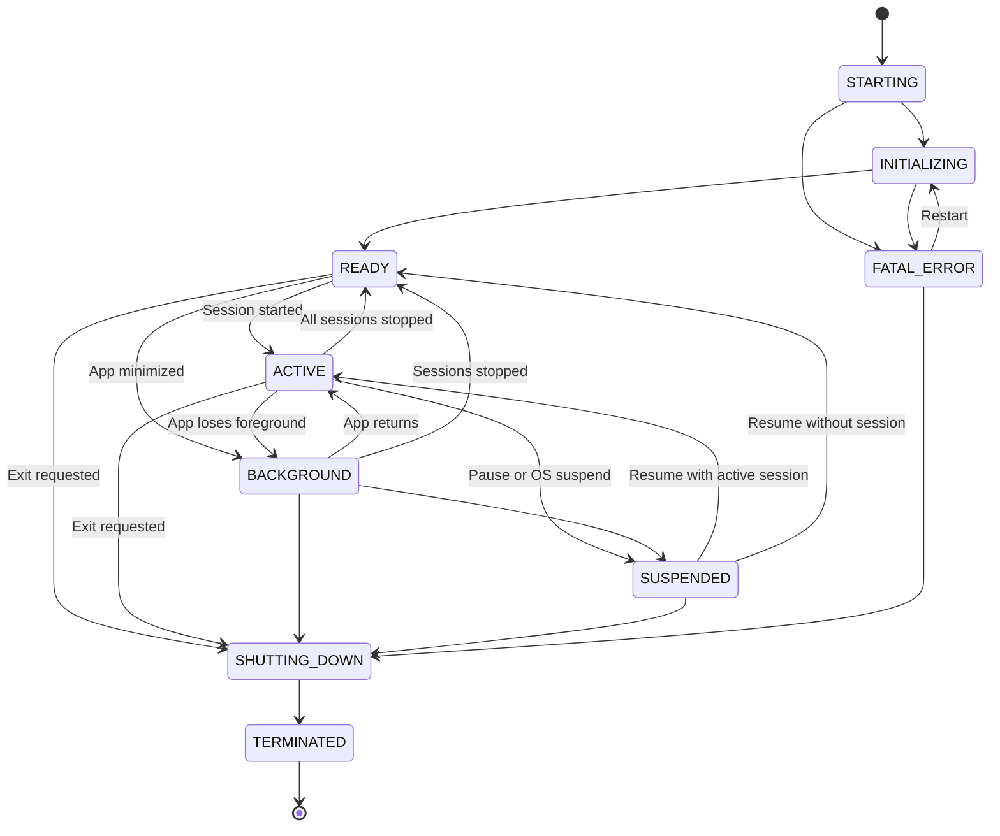
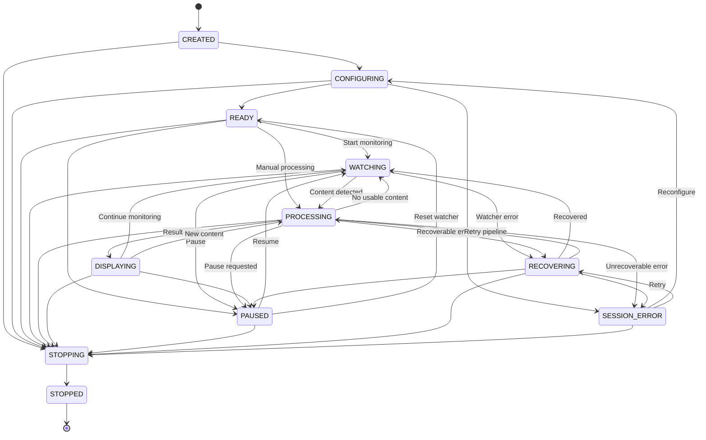
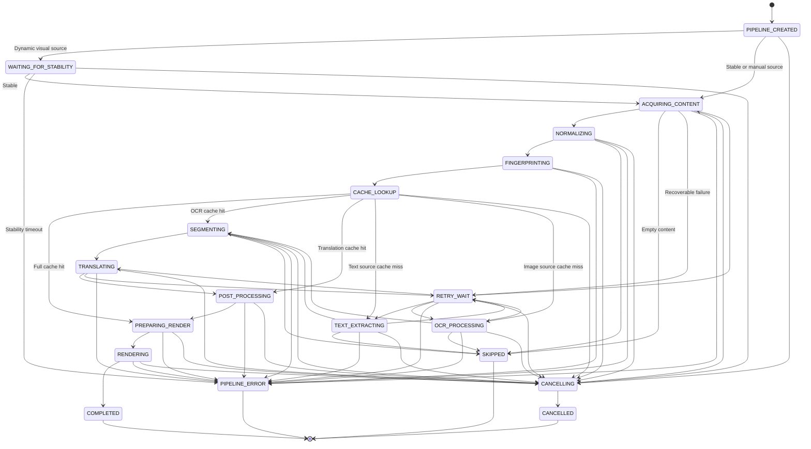

# CRAI State Machine

Version: 0.1
Status: Draft
Document Type: Architecture
Path: `docs/architecture/STATE_MACHINE.md`

---

## 1. Mục đích

Tài liệu này định nghĩa state machine của CRAI.

State machine được sử dụng để kiểm soát:

* vòng đời ứng dụng
* vòng đời phiên đọc
* quá trình phát hiện nội dung
* quá trình OCR
* quá trình dịch
* quá trình hiển thị
* pause và resume
* retry và fallback
* xử lý lỗi
* hủy tác vụ cũ khi nội dung thay đổi

Mục tiêu chính là bảo đảm CRAI hoạt động theo một luồng có thể dự đoán, tránh:

* chạy OCR trùng lặp
* dịch cùng một nội dung nhiều lần
* kết quả cũ ghi đè kết quả mới
* nhiều tác vụ chạy đồng thời ngoài kiểm soát
* lặp retry vô hạn
* render sai trang hoặc sai vùng đọc
* tiêu tốn CPU, GPU hoặc API không cần thiết

---

## 2. Phạm vi

State machine trong tài liệu này áp dụng cho:

1. Application State
2. Reading Session State
3. Capture State
4. Content Detection State
5. OCR State
6. Translation State
7. Render State
8. Error Recovery State

State machine không định nghĩa chi tiết:

* giao diện từng màn hình
* cấu trúc database
* implementation cụ thể của OCR provider
* implementation cụ thể của translation provider
* giao thức Event Bus
* API contract giữa các module

Các phần đó được mô tả trong tài liệu riêng.

---

## 3. Nguyên tắc thiết kế

### 3.1 Một phiên đọc có một trạng thái chính

Tại mỗi thời điểm, một reading session chỉ có một trạng thái xử lý chính.

Ví dụ:

```text
WATCHING
CAPTURING
OCR_PROCESSING
TRANSLATING
RENDERING
```

Không để cùng một session vừa OCR vừa bắt đầu OCR một nội dung khác mà không có cơ chế hủy hoặc phân phiên bản.

---

### 3.2 Mọi tác vụ phải gắn với phiên bản nội dung

Mỗi lần phát hiện nội dung mới, hệ thống tạo một `contentRevision`.

Ví dụ:

```text
sessionId: session-01
contentRevision: 42
```

Mọi tác vụ sau đó phải mang theo:

* `sessionId`
* `contentRevision`
* `taskId`

Khi tác vụ hoàn thành, hệ thống chỉ chấp nhận kết quả nếu `contentRevision` vẫn là phiên bản hiện tại.

Điều này ngăn trường hợp:

```text
Trang A bắt đầu OCR
Người dùng chuyển sang trang B
OCR của trang A hoàn thành muộn
Kết quả trang A ghi đè lên trang B
```

---

### 3.3 Nội dung thay đổi phải hủy pipeline cũ

Khi phát hiện nội dung mới trong lúc pipeline cũ đang chạy:

```text
CAPTURING
OCR_PROCESSING
TRANSLATING
RENDERING
```

hệ thống phải đánh dấu pipeline cũ là stale.

Tùy khả năng của provider, CRAI có thể:

* hủy request đang chạy
* bỏ qua kết quả khi request hoàn thành
* thu hồi tài nguyên tạm
* bắt đầu pipeline mới sau debounce

---

### 3.4 Không xử lý khi nội dung chưa ổn định

Đối với truyện tranh hoặc vùng chụp màn hình, CRAI không OCR ngay khi phát hiện pixel thay đổi.

Hệ thống phải chờ:

* animation kết thúc
* cuộn trang dừng
* ảnh tải xong
* vùng đọc ổn định trong một khoảng thời gian

Trạng thái `WAITING_FOR_STABILITY` được dùng cho mục đích này.

---

### 3.5 Cache được kiểm tra trước tác vụ tốn chi phí

Thứ tự ưu tiên:

```text
Detect Content
    ↓
Normalize Content
    ↓
Calculate Fingerprint
    ↓
Check Cache
    ↓
OCR hoặc Translate khi Cache Miss
```

Không gọi OCR hoặc translation provider nếu đã có kết quả phù hợp trong cache.

---

### 3.6 Retry phải có giới hạn

Mỗi stage có:

* số lần retry tối đa
* retry delay
* backoff policy
* error classification

Không retry tự động với lỗi cấu hình hoặc lỗi xác thực.

---

## 4. Phân cấp State Machine

CRAI sử dụng state machine theo ba cấp.

```text
Application State
    └── Reading Session State
            └── Processing Pipeline State
```

### Application State

Quản lý vòng đời toàn ứng dụng.

### Reading Session State

Quản lý một phiên đọc cụ thể.

### Processing Pipeline State

Quản lý một lần xử lý nội dung từ capture đến render.

---

# 5. Application State Machine

## 5.1 Danh sách trạng thái

```text
STARTING
INITIALIZING
READY
ACTIVE
BACKGROUND
SUSPENDED
SHUTTING_DOWN
TERMINATED
FATAL_ERROR
```

---

## 5.2 Mô tả trạng thái

### STARTING

Ứng dụng vừa được mở.

Các thành phần runtime chưa sẵn sàng.

Hoạt động:

* tạo application context
* đọc biến môi trường
* xác định platform
* chuẩn bị logging

Chuyển tiếp:

```text
STARTING → INITIALIZING
STARTING → FATAL_ERROR
```

---

### INITIALIZING

Ứng dụng đang khởi tạo các module bắt buộc.

Hoạt động:

* load configuration
* load user settings
* khởi tạo local storage
* load provider configuration
* kiểm tra quyền screen capture
* khởi tạo OCR engine
* khởi tạo translation engine
* khởi tạo cache
* khôi phục session trước nếu có

Chuyển tiếp:

```text
INITIALIZING → READY
INITIALIZING → FATAL_ERROR
```

Một provider không hoạt động chưa nhất thiết làm ứng dụng rơi vào `FATAL_ERROR`.

Ứng dụng có thể vào `READY` với capability bị giới hạn nếu:

* provider phụ không hoạt động
* cloud translation chưa cấu hình
* OCR phụ chưa tải model
* history storage tạm thời không khả dụng

---

### READY

Ứng dụng đã sẵn sàng nhưng chưa có phiên đọc đang hoạt động.

Có thể thực hiện:

* tạo session mới
* mở ảnh
* nhập văn bản
* chọn vùng màn hình
* mở lại session cũ
* thay đổi settings

Chuyển tiếp:

```text
READY → ACTIVE
READY → BACKGROUND
READY → SHUTTING_DOWN
```

---

### ACTIVE

Có ít nhất một reading session đang hoạt động.

Ứng dụng có thể:

* theo dõi vùng đọc
* capture nội dung
* OCR
* dịch
* render overlay hoặc panel

Chuyển tiếp:

```text
ACTIVE → READY
ACTIVE → BACKGROUND
ACTIVE → SUSPENDED
ACTIVE → SHUTTING_DOWN
```

---

### BACKGROUND

Ứng dụng không ở foreground nhưng vẫn có thể chạy tác vụ được cho phép.

Tùy cấu hình, hệ thống có thể:

* tiếp tục theo dõi vùng đọc
* chỉ duy trì hotkey
* tạm dừng capture
* hoàn thành tác vụ đang chạy
* giảm tần suất polling

Chuyển tiếp:

```text
BACKGROUND → ACTIVE
BACKGROUND → READY
BACKGROUND → SUSPENDED
BACKGROUND → SHUTTING_DOWN
```

---

### SUSPENDED

Toàn bộ pipeline xử lý tạm dừng.

Nguyên nhân:

* người dùng pause toàn ứng dụng
* hệ điều hành suspend
* mất quyền screen capture
* tài nguyên hệ thống quá thấp
* application lifecycle yêu cầu dừng

Trong trạng thái này:

* không tạo capture mới
* không tạo OCR task mới
* không tạo translation task mới
* tác vụ đang chạy có thể bị hủy hoặc chờ hoàn tất tùy policy

Chuyển tiếp:

```text
SUSPENDED → ACTIVE
SUSPENDED → READY
SUSPENDED → SHUTTING_DOWN
```

---

### SHUTTING_DOWN

Ứng dụng đang đóng.

Hoạt động:

* dừng watcher
* hủy task còn lại
* lưu session
* flush cache
* flush log
* release OCR model
* release capture resource

Chuyển tiếp:

```text
SHUTTING_DOWN → TERMINATED
SHUTTING_DOWN → FATAL_ERROR
```

---

### TERMINATED

Ứng dụng đã kết thúc.

Đây là final state.

---

### FATAL_ERROR

Ứng dụng gặp lỗi không thể tiếp tục.

Ví dụ:

* application storage không thể khởi tạo
* cấu hình lõi bị hỏng hoàn toàn
* module runtime bắt buộc không load được
* xảy ra lỗi dữ liệu nghiêm trọng

Có thể thực hiện:

* ghi crash report
* lưu recovery data tối thiểu
* hiển thị thông báo lỗi
* khởi động lại ứng dụng

Chuyển tiếp:

```text
FATAL_ERROR → INITIALIZING
FATAL_ERROR → SHUTTING_DOWN
```

---

## 5.3 Sơ đồ Application State



---

# 6. Reading Session State Machine

## 6.1 Reading Session

Một reading session đại diện cho một ngữ cảnh đọc.

Ví dụ:

* một tab web novel
* một website truyện tranh
* một vùng màn hình đã chọn
* một file EPUB
* một file ảnh
* một clipboard translation session

Một session tối thiểu có:

```text
sessionId
sessionType
sourceType
sourceLanguage
targetLanguage
region
providerProfile
displayMode
status
currentContentRevision
createdAt
updatedAt
```

---

## 6.2 Loại session

```text
TEXT_READING
IMAGE_READING
MANUAL_IMAGE
CLIPBOARD
DOCUMENT
```

Trong phiên bản đầu, CRAI nên ưu tiên:

```text
TEXT_READING
IMAGE_READING
MANUAL_IMAGE
```

---

## 6.3 Danh sách trạng thái session

```text
CREATED
CONFIGURING
READY
WATCHING
PROCESSING
DISPLAYING
PAUSED
RECOVERING
STOPPING
STOPPED
SESSION_ERROR
```

---

### CREATED

Session vừa được tạo nhưng chưa có đủ cấu hình.

Chuyển tiếp:

```text
CREATED → CONFIGURING
CREATED → STOPPING
```

---

### CONFIGURING

Hệ thống đang chuẩn bị session.

Có thể bao gồm:

* chọn nguồn
* chọn vùng đọc
* chọn ngôn ngữ
* chọn provider
* chọn display mode
* kiểm tra quyền truy cập
* kiểm tra source availability

Chuyển tiếp:

```text
CONFIGURING → READY
CONFIGURING → SESSION_ERROR
CONFIGURING → STOPPING
```

---

### READY

Session đã đủ cấu hình nhưng chưa bắt đầu theo dõi.

Có thể:

* bắt đầu watcher
* chạy dịch thủ công
* kiểm tra preview
* lưu session template

Chuyển tiếp:

```text
READY → WATCHING
READY → PROCESSING
READY → PAUSED
READY → STOPPING
```

---

### WATCHING

Session đang theo dõi nội dung nguồn.

Hệ thống chờ một trong các sự kiện:

* text changed
* screen changed
* new image loaded
* scroll ended
* page changed
* manual capture requested
* clipboard changed

Chuyển tiếp:

```text
WATCHING → PROCESSING
WATCHING → PAUSED
WATCHING → RECOVERING
WATCHING → STOPPING
```

---

### PROCESSING

Session đang có pipeline xử lý nội dung.

Pipeline có thể đang:

* capture
* normalize
* OCR
* segment
* translate
* prepare render

Chi tiết stage được quản lý bởi Processing Pipeline State Machine.

Chuyển tiếp:

```text
PROCESSING → DISPLAYING
PROCESSING → WATCHING
PROCESSING → PAUSED
PROCESSING → RECOVERING
PROCESSING → SESSION_ERROR
PROCESSING → STOPPING
```

---

### DISPLAYING

Kết quả hiện tại đã được hiển thị.

Tùy session type, hệ thống có thể:

* trở lại `WATCHING` ngay
* giữ kết quả đến khi người dùng đóng
* chờ thao tác chỉnh sửa
* chờ export

Chuyển tiếp:

```text
DISPLAYING → WATCHING
DISPLAYING → PROCESSING
DISPLAYING → PAUSED
DISPLAYING → STOPPING
```

---

### PAUSED

Session tạm dừng.

Trong trạng thái này:

* không theo dõi nội dung mới
* không tạo pipeline mới
* giữ cấu hình session
* giữ kết quả hiển thị hiện tại
* có thể giữ hoặc ẩn overlay tùy settings

Chuyển tiếp:

```text
PAUSED → WATCHING
PAUSED → READY
PAUSED → STOPPING
```

---

### RECOVERING

Session đang phục hồi sau lỗi có thể khắc phục.

Ví dụ:

* watcher mất nguồn
* browser window bị ẩn
* capture permission tạm thời mất
* OCR provider timeout
* translation provider unavailable
* GPU resource bị thu hồi

Hoạt động:

* retry có giới hạn
* đổi provider fallback
* yêu cầu cấp lại quyền
* tìm lại cửa sổ nguồn
* khởi tạo lại watcher

Chuyển tiếp:

```text
RECOVERING → WATCHING
RECOVERING → PROCESSING
RECOVERING → PAUSED
RECOVERING → SESSION_ERROR
RECOVERING → STOPPING
```

---

### SESSION_ERROR

Session gặp lỗi không thể tự phục hồi.

Ứng dụng vẫn có thể tiếp tục hoạt động và các session khác không bị ảnh hưởng.

Ví dụ:

* source không còn tồn tại
* vùng đọc không hợp lệ
* không có OCR provider khả dụng
* không có translation provider khả dụng
* cấu hình session bị lỗi

Chuyển tiếp:

```text
SESSION_ERROR → CONFIGURING
SESSION_ERROR → RECOVERING
SESSION_ERROR → STOPPING
```

---

### STOPPING

Session đang dừng.

Hoạt động:

* dừng watcher
* hủy pipeline
* xóa resource tạm
* lưu session state
* đóng overlay liên quan

Chuyển tiếp:

```text
STOPPING → STOPPED
```

---

### STOPPED

Session đã dừng.

Đây là final state của session hiện tại.

Session có thể được dùng làm dữ liệu để tạo một session mới khi restore.

---

## 6.4 Sơ đồ Reading Session



---

# 7. Processing Pipeline State Machine

## 7.1 Tổng quan

Mỗi nội dung mới tạo một processing pipeline.

Pipeline tiêu chuẩn:

```text
Content Detected
    ↓
Wait for Stability
    ↓
Acquire Content
    ↓
Normalize
    ↓
Fingerprint
    ↓
Cache Lookup
    ↓
OCR hoặc Text Extraction
    ↓
Segmentation
    ↓
Translation
    ↓
Post-processing
    ↓
Render
```

Không phải session nào cũng đi qua toàn bộ stage.

Ví dụ phiên đọc chữ có thể bỏ qua:

```text
CAPTURING
OCR_PROCESSING
```

Phiên dịch ảnh bắt buộc đi qua OCR.

---

## 7.2 Danh sách trạng thái pipeline

```text
PIPELINE_CREATED
WAITING_FOR_STABILITY
ACQUIRING_CONTENT
NORMALIZING
FINGERPRINTING
CACHE_LOOKUP
TEXT_EXTRACTING
OCR_PROCESSING
SEGMENTING
TRANSLATING
POST_PROCESSING
PREPARING_RENDER
RENDERING
COMPLETED
SKIPPED
CANCELLING
CANCELLED
RETRY_WAIT
PIPELINE_ERROR
```

---

### PIPELINE_CREATED

Pipeline vừa được tạo.

Dữ liệu bắt buộc:

```text
pipelineId
sessionId
contentRevision
triggerType
createdAt
```

Chuyển tiếp phụ thuộc loại nội dung:

```text
PIPELINE_CREATED → WAITING_FOR_STABILITY
PIPELINE_CREATED → ACQUIRING_CONTENT
PIPELINE_CREATED → CANCELLING
```

---

### WAITING_FOR_STABILITY

Chờ nội dung nguồn ổn định.

Áp dụng chủ yếu cho:

* màn hình
* trang web có lazy loading
* truyện tranh cuộn dọc
* animation chuyển trang
* ảnh đang tải

Điều kiện ổn định có thể gồm:

```text
Không có thay đổi đáng kể trong N milliseconds
Kích thước vùng nguồn không đổi
Hash nhanh của nhiều frame liên tiếp giống nhau
Scroll velocity bằng 0
Không còn loading indicator đã biết
```

Chuyển tiếp:

```text
WAITING_FOR_STABILITY → ACQUIRING_CONTENT
WAITING_FOR_STABILITY → CANCELLING
WAITING_FOR_STABILITY → PIPELINE_ERROR
```

Nếu nội dung tiếp tục thay đổi, timer ổn định được reset thay vì tạo pipeline mới liên tục.

---

### ACQUIRING_CONTENT

Lấy nội dung từ nguồn.

Nguồn có thể là:

* DOM text
* browser accessibility tree
* clipboard
* file
* screenshot
* selected screen region
* imported image

Kết quả có thể là:

```text
RawText
RawImage
DocumentFragment
```

Chuyển tiếp:

```text
ACQUIRING_CONTENT → NORMALIZING
ACQUIRING_CONTENT → SKIPPED
ACQUIRING_CONTENT → RETRY_WAIT
ACQUIRING_CONTENT → PIPELINE_ERROR
```

---

### NORMALIZING

Chuẩn hóa dữ liệu đầu vào.

Đối với text:

* chuẩn hóa Unicode
* loại bỏ whitespace thừa
* giữ paragraph boundary
* loại bỏ thành phần không liên quan
* phát hiện encoding lỗi

Đối với image:

* crop
* scale
* rotate
* deskew
* denoise
* contrast adjustment
* chuẩn hóa color space

Chuyển tiếp:

```text
NORMALIZING → FINGERPRINTING
NORMALIZING → SKIPPED
NORMALIZING → PIPELINE_ERROR
```

---

### FINGERPRINTING

Tạo fingerprint cho nội dung.

Fingerprint được dùng để:

* phát hiện nội dung trùng
* cache lookup
* chống OCR lặp lại
* chống translate lặp lại
* xác định stale result

Fingerprint có thể kết hợp:

```text
source fingerprint
normalized content hash
region metadata
source language
target language
OCR profile
translation profile
glossary version
```

Chuyển tiếp:

```text
FINGERPRINTING → CACHE_LOOKUP
FINGERPRINTING → PIPELINE_ERROR
```

---

### CACHE_LOOKUP

Tìm kết quả trong cache.

Có thể có nhiều lớp cache:

```text
Capture Cache
OCR Cache
Translation Cache
Rendered Layout Cache
```

Các kết quả:

```text
FULL_CACHE_HIT
OCR_CACHE_HIT
TRANSLATION_CACHE_HIT
CACHE_MISS
```

Chuyển tiếp ví dụ:

```text
FULL_CACHE_HIT → PREPARING_RENDER
OCR_CACHE_HIT → SEGMENTING
TRANSLATION_CACHE_HIT → POST_PROCESSING
CACHE_MISS + Text Source → TEXT_EXTRACTING
CACHE_MISS + Image Source → OCR_PROCESSING
```

---

### TEXT_EXTRACTING

Trích xuất và làm sạch nội dung chữ từ nguồn không cần OCR.

Ví dụ:

* HTML DOM
* EPUB
* TXT
* clipboard
* accessibility tree

Hoạt động:

* loại bỏ menu và quảng cáo
* giữ thứ tự đoạn văn
* nhận diện tiêu đề
* nhận diện lời thoại
* xác định phần nội dung mới khi cuộn

Chuyển tiếp:

```text
TEXT_EXTRACTING → SEGMENTING
TEXT_EXTRACTING → SKIPPED
TEXT_EXTRACTING → RETRY_WAIT
TEXT_EXTRACTING → PIPELINE_ERROR
```

---

### OCR_PROCESSING

Nhận dạng chữ từ ảnh.

Output tối thiểu:

```text
recognizedText
textBlocks
boundingBoxes
confidence
readingOrder
detectedLanguage
```

Đối với truyện tranh, OCR output nên giữ:

* vị trí text block
* kích thước vùng
* hướng chữ
* thứ tự đọc
* confidence theo block

Chuyển tiếp:

```text
OCR_PROCESSING → SEGMENTING
OCR_PROCESSING → RETRY_WAIT
OCR_PROCESSING → SKIPPED
OCR_PROCESSING → PIPELINE_ERROR
```

---

### SEGMENTING

Chia nội dung thành đơn vị dịch.

Đối với truyện chữ:

* paragraph
* sentence group
* dialogue block
* chapter fragment

Đối với truyện tranh:

* speech bubble
* narration box
* sound effect
* independent text region

Mục tiêu:

* không làm mất ngữ cảnh
* không tạo request quá lớn
* không cắt câu sai
* giữ mapping với vị trí nguồn

Chuyển tiếp:

```text
SEGMENTING → TRANSLATING
SEGMENTING → SKIPPED
SEGMENTING → PIPELINE_ERROR
```

---

### TRANSLATING

Dịch các segment.

Hoạt động có thể gồm:

* glossary lookup
* dictionary lookup
* translation memory lookup
* provider request
* fallback provider
* context merging
* batch translation
* streaming translation

Mỗi translation result phải giữ mapping:

```text
segmentId
sourceText
translatedText
sourceRegion
confidence
provider
glossaryVersion
```

Chuyển tiếp:

```text
TRANSLATING → POST_PROCESSING
TRANSLATING → RETRY_WAIT
TRANSLATING → PIPELINE_ERROR
```

---

### POST_PROCESSING

Chuẩn hóa kết quả dịch.

Hoạt động:

* khôi phục format
* sửa spacing
* chuẩn hóa dấu câu
* áp dụng glossary override
* xử lý tên riêng
* ghép đoạn
* kiểm tra text overflow
* tạo metadata chỉnh sửa

Chuyển tiếp:

```text
POST_PROCESSING → PREPARING_RENDER
POST_PROCESSING → PIPELINE_ERROR
```

---

### PREPARING_RENDER

Chuẩn bị layout hiển thị.

Đối với text:

* paragraph layout
* line wrapping
* font selection
* font size
* alignment
* reader panel layout

Đối với image:

* map bản dịch vào text region
* tính kích thước font
* xác định text wrapping
* kiểm tra overflow
* chọn overlay hoặc side panel
* xác định background mask nếu cần

Chuyển tiếp:

```text
PREPARING_RENDER → RENDERING
PREPARING_RENDER → PIPELINE_ERROR
```

---

### RENDERING

Hiển thị kết quả.

Display mode có thể là:

```text
OVERLAY
SIDE_PANEL
FLOATING_WINDOW
READER_VIEW
EXPORT_ONLY
```

Trước khi render phải kiểm tra:

```text
session còn hoạt động
contentRevision còn hiện tại
source region còn hợp lệ
pipeline chưa bị hủy
```

Chuyển tiếp:

```text
RENDERING → COMPLETED
RENDERING → CANCELLING
RENDERING → PIPELINE_ERROR
```

---

### COMPLETED

Pipeline hoàn thành thành công.

Hoạt động sau hoàn thành:

* cập nhật current result
* lưu cache
* ghi metrics
* giải phóng resource tạm
* thông báo session quay lại watching

Đây là final state.

---

### SKIPPED

Pipeline bị bỏ qua nhưng không phải lỗi.

Ví dụ:

* nội dung rỗng
* nội dung không thay đổi
* chỉ có ảnh không chứa text
* confidence thấp hơn ngưỡng và policy yêu cầu bỏ qua
* fingerprint trùng với nội dung đang hiển thị

Đây là final state.

---

### RETRY_WAIT

Pipeline đang chờ trước khi retry.

Dữ liệu cần giữ:

```text
failedStage
attempt
maxAttempts
retryAt
errorCode
provider
```

Chuyển tiếp:

```text
RETRY_WAIT → trạng thái đã lỗi
RETRY_WAIT → CANCELLING
RETRY_WAIT → PIPELINE_ERROR
```

---

### CANCELLING

Pipeline đang được hủy.

Nguyên nhân:

* nội dung mới xuất hiện
* session dừng
* người dùng pause
* application shutdown
* task timeout
* provider bị thay đổi
* source region thay đổi

Hoạt động:

* gửi cancellation token
* ngắt watcher phụ
* đánh dấu result là stale
* đóng stream
* release buffer

Chuyển tiếp:

```text
CANCELLING → CANCELLED
```

---

### CANCELLED

Pipeline đã bị hủy.

Đây là final state.

Không hiển thị lỗi cho người dùng nếu việc hủy là hành vi bình thường do nội dung mới xuất hiện.

---

### PIPELINE_ERROR

Pipeline thất bại và không thể tự retry.

Đây là final state của pipeline.

Session có thể:

* tiếp tục watching
* chuyển sang recovering
* chuyển sang session error

Quyết định phụ thuộc mức độ lỗi.

---

## 7.3 Sơ đồ Pipeline



---

# 8. Text Reading State Flow

Phiên đọc chữ ưu tiên lấy text trực tiếp thay vì OCR.

Luồng chính:

```text
WATCHING
    ↓
TEXT_CHANGE_DETECTED
    ↓
PIPELINE_CREATED
    ↓
ACQUIRING_CONTENT
    ↓
NORMALIZING
    ↓
FINGERPRINTING
    ↓
CACHE_LOOKUP
    ↓
TEXT_EXTRACTING
    ↓
SEGMENTING
    ↓
TRANSLATING
    ↓
POST_PROCESSING
    ↓
PREPARING_RENDER
    ↓
RENDERING
    ↓
COMPLETED
    ↓
WATCHING
```

## 8.1 Khi người dùng cuộn trang

Không dịch lại toàn bộ document.

Hệ thống cần xác định:

```text
visible text
new text
previously translated text
removed text
```

Chỉ tạo segment mới cho phần chưa có translation tương ứng.

---

## 8.2 Khi DOM thay đổi liên tục

Áp dụng:

* debounce
* mutation batching
* stable DOM window
* content fingerprint

Không tạo pipeline cho từng DOM mutation riêng lẻ.

---

## 8.3 Khi không lấy được DOM text

Fallback có thể là:

```text
DOM extraction
    ↓ failed
Accessibility extraction
    ↓ failed
Screen capture + OCR
```

Việc fallback sang OCR phải được ghi trong pipeline metadata.

---

# 9. Image Reading State Flow

Luồng chính cho truyện tranh:

```text
WATCHING
    ↓
SCREEN_CHANGE_DETECTED
    ↓
WAITING_FOR_STABILITY
    ↓
ACQUIRING_CONTENT
    ↓
NORMALIZING
    ↓
FINGERPRINTING
    ↓
CACHE_LOOKUP
    ↓
OCR_PROCESSING
    ↓
SEGMENTING
    ↓
TRANSLATING
    ↓
POST_PROCESSING
    ↓
PREPARING_RENDER
    ↓
RENDERING
    ↓
COMPLETED
    ↓
WATCHING
```

---

## 9.1 Khi người dùng cuộn truyện tranh dọc

Trong lúc đang cuộn:

```text
WATCHING → WAITING_FOR_STABILITY
```

Nếu frame tiếp tục thay đổi:

```text
reset stability timer
```

Chỉ sau khi cuộn dừng mới thực hiện capture chất lượng cao.

Có thể sử dụng capture chất lượng thấp để phát hiện thay đổi, sau đó capture chất lượng cao để OCR.

---

## 9.2 Khi chỉ một phần màn hình thay đổi

Hệ thống có thể tạo dirty region.

```text
Previous Frame
Current Frame
    ↓
Image Difference
    ↓
Dirty Regions
```

Nếu khả thi, chỉ OCR dirty region thay vì toàn bộ vùng đọc.

Tuy nhiên, phiên bản đầu có thể OCR toàn vùng để giảm độ phức tạp.

---

## 9.3 Khi overlay làm thay đổi ảnh nguồn

Overlay của CRAI không được khiến watcher hiểu nhầm là nội dung nguồn thay đổi.

Các chiến lược:

* loại overlay khỏi capture
* dùng capture API lấy trực tiếp cửa sổ nguồn
* mask vùng overlay trước khi so sánh
* tạm ẩn overlay trong thời điểm capture
* render overlay ở layer không xuất hiện trong source capture

Đây là yêu cầu kiến trúc bắt buộc đối với chế độ overlay.

---

# 10. Manual Image State Flow

Với ảnh được kéo thả hoặc chọn từ file:

```text
CREATED
    ↓
CONFIGURING
    ↓
READY
    ↓
PROCESSING
    ↓
ACQUIRING_CONTENT
    ↓
NORMALIZING
    ↓
OCR_PROCESSING
    ↓
SEGMENTING
    ↓
TRANSLATING
    ↓
RENDERING
    ↓
DISPLAYING
```

Không cần:

```text
WATCHING
WAITING_FOR_STABILITY
```

trừ khi người dùng bật chế độ theo dõi thư mục hoặc nguồn động.

---

# 11. Pause và Resume

## 11.1 Pause session

Khi người dùng pause:

1. Không tạo pipeline mới.
2. Dừng watcher hoặc bỏ qua event từ watcher.
3. Tác vụ hiện tại xử lý theo `pausePolicy`.
4. Giữ session configuration.
5. Giữ kết quả hiện tại nếu không có yêu cầu ẩn.

Các `pausePolicy` có thể là:

```text
CANCEL_IMMEDIATELY
FINISH_CURRENT_STAGE
FINISH_CURRENT_PIPELINE
```

Khuyến nghị mặc định:

```text
Image Reading: CANCEL_IMMEDIATELY
Text Reading: FINISH_CURRENT_STAGE
Manual Image: FINISH_CURRENT_PIPELINE
```

---

## 11.2 Resume session

Khi resume:

1. Kiểm tra source còn tồn tại.
2. Kiểm tra quyền capture.
3. Tăng watcher generation.
4. Capture lại trạng thái hiện tại.
5. So sánh với fingerprint trước pause.
6. Chỉ tạo pipeline nếu nội dung đã thay đổi.

---

# 12. Cancellation Model

Mỗi pipeline phải có cancellation token.

Cấu trúc khái niệm:

```text
CancellationContext
- applicationCancellation
- sessionCancellation
- pipelineCancellation
- timeoutCancellation
```

Một task bị hủy nếu bất kỳ context cha nào bị hủy.

Ví dụ:

```text
Application shutdown
    ↓
Cancel all sessions
    ↓
Cancel all pipelines
    ↓
Cancel all provider requests
```

---

## 12.1 Lý do hủy

```text
NEWER_CONTENT_AVAILABLE
SESSION_PAUSED
SESSION_STOPPED
SOURCE_CHANGED
REGION_CHANGED
PROVIDER_CHANGED
APPLICATION_SHUTDOWN
TASK_TIMEOUT
USER_CANCELLED
RESOURCE_PRESSURE
```

Lý do hủy phải được ghi trong log và metrics nhưng không phải lúc nào cũng hiển thị cho người dùng.

---

# 13. Retry State Machine

## 13.1 Phân loại lỗi

### Transient Error

Có thể retry:

* network timeout
* rate limit tạm thời
* provider overload
* temporary capture failure
* model đang load
* GPU resource tạm thời không sẵn sàng

### Configuration Error

Không retry tự động:

* API key sai
* provider chưa cấu hình
* language pair không được hỗ trợ
* OCR model không tồn tại
* đường dẫn file sai

### Content Error

Thường không retry hoặc chỉ retry với strategy khác:

* ảnh không có text
* ảnh quá mờ
* text confidence quá thấp
* input vượt giới hạn
* encoding hỏng

### Permanent Error

Không retry:

* source đã đóng
* quyền truy cập bị từ chối vĩnh viễn
* provider account bị khóa
* dữ liệu session bị hỏng không phục hồi được

---

## 13.2 Retry policy mặc định

```text
Capture:
- maxAttempts: 2
- delay: 200ms

OCR local:
- maxAttempts: 1
- fallback sang OCR khác nếu có

OCR remote:
- maxAttempts: 2
- exponential backoff

Translation:
- maxAttempts: 2
- fallback provider nếu được cấu hình

Render:
- maxAttempts: 1
- fallback từ overlay sang panel nếu phù hợp
```

Các giá trị trên chỉ là mặc định ban đầu và phải cấu hình được.

---

## 13.3 Backoff

Công thức đề xuất:

```text
delay = min(baseDelay × 2^attempt + jitter, maxDelay)
```

Pipeline phải kiểm tra cancellation token trong thời gian chờ retry.

---

# 14. Provider Fallback State

Translation hoặc OCR có thể sử dụng nhiều provider.

Ví dụ:

```text
PRIMARY_PROVIDER
    ↓ failed
SECONDARY_PROVIDER
    ↓ failed
LOCAL_FALLBACK
    ↓ failed
PIPELINE_ERROR
```

Provider fallback không được tạo vòng lặp.

Mỗi provider chỉ được thử tối đa theo policy của pipeline.

Metadata phải lưu:

```text
attemptedProviders
selectedProvider
fallbackReason
providerLatency
providerError
```

---

# 15. Timeout

Mỗi stage phải có timeout độc lập.

Ví dụ:

```text
Capture Timeout
OCR Timeout
Translation Timeout
Render Timeout
Pipeline Timeout
```

Pipeline timeout là giới hạn tổng.

Nếu stage timeout:

```text
Stage timeout
    ↓
Cancel stage
    ↓
Retry hoặc fallback
    ↓
Pipeline error nếu hết lựa chọn
```

Không để provider request treo vô thời hạn.

---

# 16. Stale Result Protection

Trước khi một stage ghi kết quả, phải kiểm tra:

```text
pipeline.sessionId == currentSession.id
pipeline.contentRevision == session.currentContentRevision
pipeline.status not in [CANCELLING, CANCELLED]
session.status not in [STOPPING, STOPPED]
```

Trước khi render phải kiểm tra thêm:

```text
source identity còn đúng
region version còn đúng
display target còn tồn tại
```

Kết quả stale có thể được lưu cache nếu hợp lệ, nhưng không được hiển thị lên session hiện tại.

---

# 17. State Transition Rules

## 17.1 Transition phải hợp lệ

Không module nào được tự ý gán state trực tiếp.

Mọi thay đổi trạng thái phải đi qua:

```text
StateTransitionService
```

hoặc cơ chế tương đương.

Ví dụ không hợp lệ:

```text
pipeline.state = RENDERING
```

Ví dụ hợp lệ:

```text
transitionPipeline(
    pipelineId,
    from = PREPARING_RENDER,
    to = RENDERING,
    event = RENDER_REQUESTED
)
```

---

## 17.2 Transition phải có nguyên nhân

Mỗi transition cần ghi:

```text
entityId
fromState
toState
event
reason
timestamp
correlationId
```

Điều này giúp:

* debug
* tracing
* crash recovery
* kiểm tra pipeline race condition
* phân tích hiệu năng

---

## 17.3 Transition phải idempotent khi phù hợp

Ví dụ:

```text
PAUSED → PAUSED
STOPPING → STOPPING
CANCELLING → CANCELLING
```

có thể được xem là no-op thay vì lỗi.

Tuy nhiên:

```text
COMPLETED → TRANSLATING
STOPPED → WATCHING
CANCELLED → RENDERING
```

phải bị từ chối.

---

# 18. State Persistence

Không phải mọi trạng thái đều cần lưu xuống storage.

## 18.1 Nên lưu

```text
Session configuration
Session type
Source reference
Selected region
Language settings
Provider profile
Display mode
Last completed content fingerprint
Last translated position
Pause state nếu người dùng chủ động pause
```

---

## 18.2 Không cần lưu như trạng thái phục hồi trực tiếp

```text
OCR_PROCESSING
TRANSLATING
RENDERING
RETRY_WAIT
CANCELLING
```

Sau khi ứng dụng khởi động lại, các trạng thái trung gian phải được chuyển thành:

```text
READY
PAUSED
WATCHING
```

tùy chính sách restore.

Không tiếp tục một HTTP request hoặc OCR task cũ sau khi process đã restart.

---

# 19. Crash Recovery

Khi ứng dụng khởi động và phát hiện session chưa đóng đúng cách:

```text
Load persisted session
    ↓
Mark previous runtime as interrupted
    ↓
Validate source
    ↓
Validate permission
    ↓
Restore configuration
    ↓
Enter READY hoặc PAUSED
```

Không tự động vào `WATCHING` trong lần triển khai đầu tiên nếu điều này có thể gây chụp màn hình ngoài ý muốn.

Về sau có thể cung cấp setting:

```text
Auto Resume Last Session
```

---

# 20. Concurrency Rules

## 20.1 Mỗi session chỉ có một active pipeline mặc định

```text
maxActivePipelinesPerSession = 1
```

Khi có nội dung mới:

```text
cancel old pipeline
start new pipeline
```

---

## 20.2 Có thể song song hóa bên trong pipeline

Ví dụ:

* OCR nhiều text region
* translate nhiều segment
* cache lookup nhiều layer

Nhưng kết quả phải được tổng hợp theo đúng:

```text
pipelineId
contentRevision
segment order
```

---

## 20.3 Giới hạn tài nguyên toàn ứng dụng

Cần có global scheduler để giới hạn:

```text
maxConcurrentCaptureTasks
maxConcurrentOCRTasks
maxConcurrentTranslationTasks
maxConcurrentRenderTasks
```

Ví dụ ban đầu:

```text
Capture: 1
Local OCR: 1
Remote OCR: 2
Translation: 2
Render: 1 per session
```

Các con số này chưa phải quyết định cuối cùng.

---

# 21. Multi-session Behavior

Trong tương lai CRAI có thể hỗ trợ nhiều session.

Ví dụ:

```text
Session A: Web novel
Session B: Comic window
Session C: Manual image
```

Quy tắc:

* mỗi session có state machine độc lập
* lỗi ở một session không làm dừng session khác
* application state là `ACTIVE` nếu có ít nhất một session hoạt động
* scheduler toàn cục phân phối tài nguyên
* overlay phải gắn đúng source window
* hotkey phải xác định active session

Trong MVP có thể giới hạn:

```text
maxConcurrentReadingSessions = 1
```

nhưng kiến trúc không nên khóa cứng giới hạn này.

---

# 22. Suggested State Data Structures

Ví dụ khái niệm:

```ts
type ApplicationState =
  | "STARTING"
  | "INITIALIZING"
  | "READY"
  | "ACTIVE"
  | "BACKGROUND"
  | "SUSPENDED"
  | "SHUTTING_DOWN"
  | "TERMINATED"
  | "FATAL_ERROR";
```

```ts
type SessionState =
  | "CREATED"
  | "CONFIGURING"
  | "READY"
  | "WATCHING"
  | "PROCESSING"
  | "DISPLAYING"
  | "PAUSED"
  | "RECOVERING"
  | "STOPPING"
  | "STOPPED"
  | "SESSION_ERROR";
```

```ts
type PipelineState =
  | "PIPELINE_CREATED"
  | "WAITING_FOR_STABILITY"
  | "ACQUIRING_CONTENT"
  | "NORMALIZING"
  | "FINGERPRINTING"
  | "CACHE_LOOKUP"
  | "TEXT_EXTRACTING"
  | "OCR_PROCESSING"
  | "SEGMENTING"
  | "TRANSLATING"
  | "POST_PROCESSING"
  | "PREPARING_RENDER"
  | "RENDERING"
  | "COMPLETED"
  | "SKIPPED"
  | "RETRY_WAIT"
  | "CANCELLING"
  | "CANCELLED"
  | "PIPELINE_ERROR";
```

Đây chỉ là cấu trúc tham khảo, không bắt buộc dự án phải sử dụng TypeScript.

---

# 23. State Transition Table

## 23.1 Session transition chính

| Current State       | Event                | Next State    |
| ------------------- | -------------------- | ------------- |
| CREATED             | CONFIGURE            | CONFIGURING   |
| CONFIGURING         | CONFIGURATION_VALID  | READY         |
| CONFIGURING         | CONFIGURATION_FAILED | SESSION_ERROR |
| READY               | START_WATCHING       | WATCHING      |
| READY               | PROCESS_MANUALLY     | PROCESSING    |
| WATCHING            | CONTENT_DETECTED     | PROCESSING    |
| WATCHING            | PAUSE                | PAUSED        |
| PROCESSING          | RESULT_READY         | DISPLAYING    |
| PROCESSING          | NO_CONTENT           | WATCHING      |
| PROCESSING          | RECOVERABLE_ERROR    | RECOVERING    |
| PROCESSING          | FATAL_SESSION_ERROR  | SESSION_ERROR |
| DISPLAYING          | WATCH_NEXT           | WATCHING      |
| DISPLAYING          | CONTENT_DETECTED     | PROCESSING    |
| PAUSED              | RESUME               | WATCHING      |
| RECOVERING          | RECOVERY_SUCCEEDED   | WATCHING      |
| RECOVERING          | RETRY_PIPELINE       | PROCESSING    |
| RECOVERING          | RECOVERY_FAILED      | SESSION_ERROR |
| Any non-final state | STOP                 | STOPPING      |
| STOPPING            | CLEANUP_COMPLETED    | STOPPED       |

---

## 23.2 Pipeline transition chính

| Current State         | Event                 | Next State            |
| --------------------- | --------------------- | --------------------- |
| PIPELINE_CREATED      | WAIT_FOR_SOURCE       | WAITING_FOR_STABILITY |
| PIPELINE_CREATED      | ACQUIRE               | ACQUIRING_CONTENT     |
| WAITING_FOR_STABILITY | SOURCE_STABLE         | ACQUIRING_CONTENT     |
| ACQUIRING_CONTENT     | CONTENT_ACQUIRED      | NORMALIZING           |
| NORMALIZING           | CONTENT_NORMALIZED    | FINGERPRINTING        |
| FINGERPRINTING        | FINGERPRINT_CREATED   | CACHE_LOOKUP          |
| CACHE_LOOKUP          | FULL_CACHE_HIT        | PREPARING_RENDER      |
| CACHE_LOOKUP          | OCR_CACHE_HIT         | SEGMENTING            |
| CACHE_LOOKUP          | TRANSLATION_CACHE_HIT | POST_PROCESSING       |
| CACHE_LOOKUP          | TEXT_CACHE_MISS       | TEXT_EXTRACTING       |
| CACHE_LOOKUP          | IMAGE_CACHE_MISS      | OCR_PROCESSING        |
| TEXT_EXTRACTING       | TEXT_READY            | SEGMENTING            |
| OCR_PROCESSING        | OCR_READY             | SEGMENTING            |
| SEGMENTING            | SEGMENTS_READY        | TRANSLATING           |
| TRANSLATING           | TRANSLATION_READY     | POST_PROCESSING       |
| POST_PROCESSING       | RESULT_NORMALIZED     | PREPARING_RENDER      |
| PREPARING_RENDER      | LAYOUT_READY          | RENDERING             |
| RENDERING             | RENDER_COMPLETED      | COMPLETED             |
| Any active state      | CANCEL                | CANCELLING            |
| CANCELLING            | CLEANUP_COMPLETED     | CANCELLED             |
| Retryable state       | RETRY_SCHEDULED       | RETRY_WAIT            |
| RETRY_WAIT            | RETRY_TRIGGERED       | Failed stage          |
| Any active state      | UNRECOVERABLE_ERROR   | PIPELINE_ERROR        |

---

# 24. Metrics liên quan đến State Machine

Nên theo dõi:

```text
session_state_duration
pipeline_state_duration
pipeline_completed_total
pipeline_cancelled_total
pipeline_skipped_total
pipeline_failed_total
retry_total
fallback_total
stale_result_total
cache_hit_total
cache_miss_total
content_change_total
stability_wait_duration
```

Metrics nên phân loại theo:

```text
sessionType
sourceType
provider
languagePair
errorCode
stage
```

Không ghi nội dung truyện vào metrics hoặc log mặc định.

---

# 25. Logging

Mỗi pipeline sử dụng một `correlationId`.

Ví dụ log:

```text
sessionId=session-01
pipelineId=pipeline-42
contentRevision=42
state=OCR_PROCESSING
event=OCR_STARTED
provider=local-paddle
```

Khi chuyển trạng thái:

```text
from=OCR_PROCESSING
to=SEGMENTING
event=OCR_COMPLETED
durationMs=182
```

Không log toàn bộ:

* ảnh màn hình
* nội dung truyện
* API key
* access token
* dữ liệu cá nhân

trừ khi người dùng chủ động bật debug mode phù hợp.

---

# 26. Open Questions

Các quyết định sau chưa chốt:

## 26.1 Stability detection

* thời gian debounce mặc định là bao nhiêu?
* dùng full-frame hash hay region diff?
* ngưỡng thay đổi pixel là bao nhiêu?
* có phân biệt scroll với animation không?

## 26.2 Pipeline replacement

* luôn hủy pipeline cũ khi có nội dung mới?
* cho phép hoàn thành translation nếu gần xong?
* có ưu tiên cache result của pipeline stale không?

## 26.3 Pause policy

* pause có ẩn overlay không?
* pause có hoàn thành request đang chạy không?
* resume có tự động capture ngay không?

## 26.4 Provider fallback

* fallback tự động hay yêu cầu người dùng bật?
* provider nào được phép nhận nội dung?
* có fallback từ cloud sang local không?

## 26.5 Multi-session

* MVP chỉ có một session hay hỗ trợ nhiều session?
* session nền có tiếp tục watching không?
* session nào được ưu tiên tài nguyên?

## 26.6 Error presentation

* lỗi nào chỉ ghi log?
* lỗi nào hiển thị toast?
* lỗi nào mở màn hình cấu hình?
* khi nào chuyển từ retry sang yêu cầu người dùng xử lý?

---

# 27. MVP Recommendation

Đối với phiên bản đầu, nên giới hạn state machine như sau:

```text
Một active reading session
Một active pipeline trên session
Capture theo vùng người dùng chọn
Debounce trước OCR
Không OCR khi đang cuộn
Cache theo content fingerprint
Hủy kết quả stale
Retry tối đa hai lần
Một OCR provider chính
Một translation provider chính
Fallback thủ công hoặc cấu hình đơn giản
Pause và resume session
Lưu cấu hình session
Không restore tác vụ trung gian sau crash
```

Các giới hạn trên giúp triển khai bản đầu đơn giản hơn nhưng vẫn giữ kiến trúc có thể mở rộng.

---

# 28. Architectural Decisions Derived from This Document

Tài liệu này dẫn đến các yêu cầu kiến trúc sau:

1. Mọi pipeline phải có `pipelineId`.
2. Mọi nội dung mới phải tăng `contentRevision`.
3. Mọi task bất đồng bộ phải hỗ trợ cancellation hoặc stale-result rejection.
4. Session và pipeline phải có state machine riêng.
5. State transition phải được quản lý tập trung.
6. Watcher không được gọi trực tiếp OCR hoặc translation provider.
7. Cache phải nằm trước các tác vụ có chi phí cao.
8. Overlay không được làm watcher phát hiện thay đổi giả.
9. Retry và fallback phải có giới hạn.
10. Lỗi pipeline không được làm crash toàn ứng dụng.
11. Trạng thái xử lý trung gian không được restore trực tiếp sau khi ứng dụng restart.
12. Event Bus phải mang theo `sessionId`, `pipelineId` và `contentRevision`.

---

# 29. Related Documents

```text
.meta/AI_BOOT.md
.meta/MODULES.md
.meta/MODULES_RULE.md
.meta/USER_JOURNEY.md
docs/architecture/CAPABILITY_MAP.md
docs/architecture/EVENT_BUS.md
docs/architecture/MODULE_DEPENDENCY.md
```

`EVENT_BUS.md` phải sử dụng tên event và quy tắc chuyển trạng thái thống nhất với tài liệu này.

---

# 30. Document Status

Tài liệu hiện ở trạng thái Draft.

Trước khi chuyển sang Accepted, cần chốt tối thiểu:

* mô hình một hay nhiều session cho MVP
* stability detection cơ bản
* cancellation policy
* pause policy
* retry policy
* provider fallback policy
* display mode đầu tiên
* cách xử lý overlay trong screen capture
