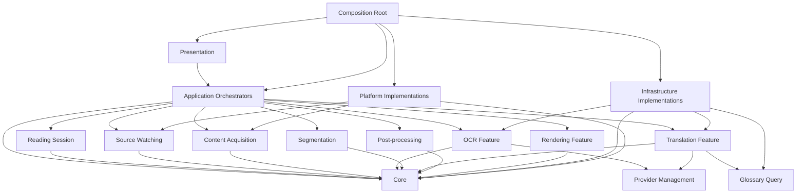

# CRAI Module Dependency Architecture

Version: 0.1
Status: Draft
Document Type: Architecture
Path: `docs/architecture/MODULE_DEPENDENCY.md`

---

## 1. Mục đích

Tài liệu này định nghĩa kiến trúc module và quy tắc dependency cho toàn bộ source code CRAI.

Mục tiêu chính:

* xác định module nào sở hữu chức năng nào
* xác định module nào được phép phụ thuộc module nào
* ngăn dependency vòng
* ngăn UI gọi trực tiếp infrastructure
* ngăn OCR, translation và renderer gọi chéo nhau
* giữ state transition tại đúng nơi
* hỗ trợ thay thế provider
* hỗ trợ mở rộng từ một process sang nhiều process
* giúp AI tạo và sửa code mà không phá kiến trúc
* giúp dự án giữ cấu trúc ổn định khi lớn lên

Tài liệu này đóng vai trò như:

```text
Source Architecture Blueprint
```

Mọi module mới hoặc dependency mới phải tuân theo tài liệu này.

---

# 2. Câu hỏi tài liệu này phải trả lời

Tài liệu phải làm rõ:

```text
Module nào tồn tại?
Module nằm ở layer nào?
Module sở hữu dữ liệu nào?
Module được phép gọi module nào?
Module được phép publish event nào?
Module được phép subscribe event nào?
Public API của module là gì?
Phần nào là internal implementation?
Dependency nào bị cấm?
Provider được thay thế tại boundary nào?
Module được khởi tạo và dispose ra sao?
```

---

# 3. Nguyên tắc kiến trúc tổng thể

CRAI sử dụng kiến trúc phân tầng kết hợp feature module.

Các layer chính:

```text
Presentation
Application
Feature
Core
Infrastructure
Platform
Shared
```

Dependency phải đi theo hướng:

```text
Presentation
      ↓
Application
      ↓
Feature
      ↓
Core abstractions
      ↑
Infrastructure implementations
      ↑
Platform implementations
```

Cách biểu diễn chính xác hơn:

```text
Presentation → Application → Feature → Core

Infrastructure → Core
Platform → Core

Composition Root
    ├── kết nối Application
    ├── kết nối Feature
    ├── inject Infrastructure
    └── inject Platform
```

Infrastructure và Platform triển khai interface được định nghĩa ở Core hoặc Feature.

Feature không phụ thuộc implementation cụ thể của Infrastructure hoặc Platform.

---

# 4. Dependency Rule cốt lõi

## 4.1 Dependency luôn hướng vào abstraction

Không hợp lệ:

```ts
import { PaddleOcrEngine } from "@/infrastructure/ocr/paddle";
```

trong feature OCR.

Hợp lệ:

```ts
import type { OcrEngine } from "@/core/contracts/ocr";
```

Implementation được inject tại Composition Root:

```ts
const ocrEngine: OcrEngine = new PaddleOcrEngine(...);
```

---

## 4.2 Layer dưới không biết layer trên

Không hợp lệ:

```text
Infrastructure → Application
Platform → Presentation
Core → Feature
Feature → Presentation
```

Ví dụ OCR provider không được biết:

* UI đang hiển thị thế nào
* session đang dùng side panel hay overlay
* người dùng vừa bấm nút gì
* pipeline tiếp theo là segmentation hay translation

---

## 4.3 Module ngang hàng không gọi chéo tùy ý

Không hợp lệ:

```text
OCR Module → Translation Module
Translation Module → Renderer Module
Watcher Module → OCR Module
Capture Module → Cache Module
```

Luồng xử lý phải do:

```text
Pipeline Orchestrator
```

điều phối.

Các module có thể giao tiếp qua:

* public interface
* command event
* result event
* shared immutable data contract

---

## 4.4 Mỗi state chỉ có một owner

Ví dụ:

```text
Application state
    → Application Lifecycle Module

Session state
    → Session Module

Pipeline state
    → Pipeline Module

Provider health state
    → Provider Registry Module

UI local state
    → UI module tương ứng
```

Không được có nhiều module tự sửa cùng một state.

---

## 4.5 Mỗi dữ liệu có một source of truth

Ví dụ:

```text
Current session configuration
    → Session Configuration Store

Current contentRevision
    → Session Runtime State

Pipeline status
    → Pipeline State Store

Glossary
    → Glossary Repository

Translation cache
    → Cache Repository
```

Các module khác chỉ:

* đọc qua public query interface
* gửi command yêu cầu thay đổi
* subscribe event thay đổi

---

# 5. Layer Architecture

## 5.1 Presentation Layer

Presentation chịu trách nhiệm:

* hiển thị UI
* nhận input người dùng
* hiển thị state
* phát application command
* render view model
* điều khiển cửa sổ ứng dụng
* quản lý UI state cục bộ

Presentation không chịu trách nhiệm:

* OCR
* translation
* capture
* state machine nghiệp vụ
* provider selection logic
* retry logic
* cache policy
* pipeline orchestration

---

## 5.2 Application Layer

Application chịu trách nhiệm:

* điều phối use case
* quản lý application lifecycle
* quản lý reading session
* quản lý processing pipeline
* áp dụng state transition
* điều phối command và result event
* cancellation propagation
* retry và fallback decision
* phối hợp giữa các feature module

Application không triển khai:

* OCR engine
* capture API
* HTTP provider client chi tiết
* database adapter
* OS API

---

## 5.3 Feature Layer

Feature chứa logic theo capability.

Ví dụ:

```text
Reading Session
Source Watching
Content Capture
Text Extraction
OCR
Segmentation
Translation
Post-processing
Rendering
Glossary
Translation Editing
Cache Coordination
Provider Management
```

Feature định nghĩa:

* use case
* domain rule
* input/output contract
* feature-specific interfaces
* event handlers của feature
* validator
* policy

Feature không phụ thuộc provider cụ thể.

---

## 5.4 Core Layer

Core chứa nền tảng dùng chung cho toàn hệ thống:

* Event Bus abstraction
* State Machine
* Scheduler
* Cancellation
* Result type
* Error model
* IDs
* Time abstraction
* Logging abstraction
* Metrics abstraction
* configuration contracts
* immutable data structures
* shared domain primitives

Core không chứa logic UI hoặc logic provider cụ thể.

Core không được phụ thuộc Feature, Infrastructure hoặc Platform.

---

## 5.5 Infrastructure Layer

Infrastructure triển khai các capability bên ngoài nhưng không phụ thuộc trực tiếp OS UI.

Ví dụ:

* OCR engine adapter
* translation provider adapter
* local database
* cache storage
* filesystem artifact store
* HTTP client
* provider credential storage
* telemetry implementation
* logging implementation

Infrastructure triển khai interface của Core hoặc Feature.

---

## 5.6 Platform Layer

Platform bao bọc API của hệ điều hành hoặc runtime desktop.

Ví dụ:

* screen capture
* window enumeration
* active window tracking
* clipboard
* global hotkey
* accessibility API
* file picker
* notification
* power state
* network state
* process management
* native overlay window

Platform không chứa domain logic.

---

## 5.7 Shared Layer

Shared chỉ chứa thành phần thật sự dùng chung và không thuộc domain cụ thể:

* utility thuần túy
* schema helpers
* serialization
* immutable collection helper
* validation primitive
* safe string utilities
* math và geometry primitive

Không được biến `shared` thành nơi chứa code không biết đặt ở đâu.

---

# 6. Cấu trúc source code đề xuất

```text
src/
├── composition/
│   ├── bootstrap/
│   ├── dependency-container/
│   ├── module-registry/
│   ├── process-topology/
│   └── shutdown/
│
├── presentation/
│   ├── app-shell/
│   ├── onboarding/
│   ├── session-controls/
│   ├── source-selector/
│   ├── region-selector/
│   ├── translation-panel/
│   ├── overlay/
│   ├── settings/
│   ├── provider-settings/
│   ├── glossary-editor/
│   ├── history/
│   ├── diagnostics/
│   └── shared-ui/
│
├── application/
│   ├── application-lifecycle/
│   ├── session-orchestrator/
│   ├── pipeline-orchestrator/
│   ├── command-router/
│   ├── event-handlers/
│   ├── retry-coordinator/
│   ├── fallback-coordinator/
│   ├── cancellation-coordinator/
│   ├── resource-coordinator/
│   └── recovery-coordinator/
│
├── features/
│   ├── reading-session/
│   ├── source-management/
│   ├── source-watching/
│   ├── stability-detection/
│   ├── content-acquisition/
│   ├── content-normalization/
│   ├── content-fingerprint/
│   ├── cache-coordination/
│   ├── text-extraction/
│   ├── ocr/
│   ├── segmentation/
│   ├── translation/
│   ├── post-processing/
│   ├── rendering/
│   ├── translation-editing/
│   ├── glossary/
│   ├── translation-memory/
│   ├── provider-management/
│   ├── language-detection/
│   ├── export/
│   └── diagnostics/
│
├── core/
│   ├── events/
│   ├── state-machine/
│   ├── scheduler/
│   ├── cancellation/
│   ├── errors/
│   ├── result/
│   ├── ids/
│   ├── clock/
│   ├── logging/
│   ├── metrics/
│   ├── tracing/
│   ├── configuration/
│   ├── lifecycle/
│   ├── concurrency/
│   ├── geometry/
│   ├── text/
│   └── contracts/
│
├── infrastructure/
│   ├── event-bus/
│   ├── persistence/
│   ├── cache/
│   ├── artifact-store/
│   ├── ocr/
│   ├── translation/
│   ├── language-detection/
│   ├── http/
│   ├── credentials/
│   ├── logging/
│   ├── metrics/
│   ├── configuration/
│   └── diagnostics/
│
├── platform/
│   ├── screen-capture/
│   ├── window-management/
│   ├── active-window/
│   ├── accessibility/
│   ├── clipboard/
│   ├── global-hotkey/
│   ├── filesystem/
│   ├── file-dialog/
│   ├── notifications/
│   ├── network-status/
│   ├── power-state/
│   ├── process/
│   └── secure-storage/
│
└── shared/
    ├── validation/
    ├── serialization/
    ├── collections/
    ├── async/
    ├── strings/
    ├── numbers/
    └── testing/
```

Không bắt buộc tạo toàn bộ thư mục ngay từ MVP.

Chỉ tạo module khi capability thực sự được triển khai.

Tuy nhiên module mới phải đặt đúng vị trí theo blueprint này.

---

# 7. Composition Layer

Composition là nơi duy nhất được phép biết implementation cụ thể.

Ví dụ:

```ts
const eventBus = new InMemoryEventBus();

const screenCapture = new WindowsScreenCaptureAdapter();

const ocrEngine = new PaddleOcrAdapter({
  modelPath: configuration.ocr.modelPath
});

const translationProvider = new OpenAiTranslationAdapter({
  credentialProvider
});

const pipelineOrchestrator = new PipelineOrchestrator({
  eventBus,
  stateMachine,
  scheduler,
  ocrService,
  translationService,
  renderer
});
```

Composition Layer chịu trách nhiệm:

* tạo instance
* inject dependency
* chọn provider implementation
* đăng ký module
* khởi động module
* dispose module
* quyết định process topology
* wiring event subscriber
* kiểm tra dependency graph

Composition không chứa business logic.

---

## 7.1 Composition Root

Entry point đề xuất:

```text
src/composition/bootstrap/main.ts
```

Hoặc tùy công nghệ:

```text
main.go
Program.cs
main.rs
bootstrap.ts
```

Composition Root là nơi duy nhất có thể import đồng thời:

```text
Application
Feature
Infrastructure
Platform
Presentation
```

Các module khác không có quyền wiring toàn hệ thống.

---

# 8. Danh sách module cấp cao

## 8.1 Composition Modules

```text
Bootstrap
Dependency Container
Module Registry
Process Topology
Shutdown Coordinator
```

## 8.2 Presentation Modules

```text
App Shell
Onboarding
Session Controls
Source Selector
Region Selector
Translation Panel
Overlay View
Settings
Provider Settings
Glossary Editor
History View
Diagnostics View
Shared UI
```

## 8.3 Application Modules

```text
Application Lifecycle
Session Orchestrator
Pipeline Orchestrator
Command Router
Application Event Handlers
Retry Coordinator
Fallback Coordinator
Cancellation Coordinator
Resource Coordinator
Recovery Coordinator
```

## 8.4 Feature Modules

```text
Reading Session
Source Management
Source Watching
Stability Detection
Content Acquisition
Content Normalization
Content Fingerprint
Cache Coordination
Text Extraction
OCR
Segmentation
Translation
Post-processing
Rendering
Translation Editing
Glossary
Translation Memory
Provider Management
Language Detection
Export
Diagnostics
```

## 8.5 Core Modules

```text
Events
State Machine
Scheduler
Cancellation
Errors
Result
IDs
Clock
Logging
Metrics
Tracing
Configuration
Lifecycle
Concurrency
Geometry
Text Primitives
Contracts
```

## 8.6 Infrastructure Modules

```text
In-memory Event Bus
Persistent Storage
Cache Storage
Artifact Store
OCR Adapters
Translation Adapters
Language Detection Adapters
HTTP
Credential Storage
Logging
Metrics
Configuration Store
Diagnostics
```

## 8.7 Platform Modules

```text
Screen Capture
Window Management
Active Window
Accessibility
Clipboard
Global Hotkey
Filesystem
File Dialog
Notifications
Network Status
Power State
Process
Secure Storage
```

---

# 9. Module contract chuẩn

Mỗi module nên có cấu trúc tương tự:

```text
<module>/
├── index.ts
├── public/
│   ├── contracts.ts
│   ├── commands.ts
│   ├── queries.ts
│   ├── events.ts
│   └── types.ts
├── application/
│   ├── handlers/
│   ├── services/
│   └── policies/
├── domain/
│   ├── models/
│   ├── rules/
│   └── errors/
├── internal/
│   ├── implementation/
│   └── helpers/
└── tests/
```

Không phải module nào cũng cần đủ mọi thư mục.

Nguyên tắc bắt buộc:

```text
Module bên ngoài chỉ import từ index hoặc public.
```

Không được import:

```text
@/features/ocr/internal/paddle-result-mapper
```

Hợp lệ:

```text
@/features/ocr
```

---

# 10. Public API và Internal API

## 10.1 Public API

Public API có thể bao gồm:

* interface
* command
* query
* public data type
* event contract
* factory
* module lifecycle contract

Ví dụ:

```ts
export interface OcrService {
  recognize(
    request: OcrRequest,
    context: TaskContext
  ): Promise<Result<OcrResult, OcrError>>;
}
```

---

## 10.2 Internal API

Internal API bao gồm:

* provider mapping
* helper
* parser
* internal repository implementation
* temporary model
* optimization
* provider-specific DTO

Không được expose:

```ts
export * from "./internal";
```

---

## 10.3 Module index

Mỗi module phải có một entry point rõ ràng:

```ts
export type {
  OcrService,
  OcrRequest,
  OcrResult,
  OcrError
} from "./public/contracts";

export {
  OCR_PROCESS_REQUESTED,
  OCR_COMPLETED,
  OCR_FAILED
} from "./public/events";
```

---

# 11. Application Lifecycle Module

## Trách nhiệm

* điều khiển startup
* initialization
* readiness
* suspend
* resume
* shutdown
* fatal recovery
* khởi động và dừng module theo thứ tự

## Sở hữu

```text
ApplicationState
applicationInstanceId
startup status
shutdown status
```

## Được phụ thuộc

```text
Core Lifecycle
Core State Machine
Core Events
Module Registry
```

## Không được phụ thuộc trực tiếp

```text
PaddleOCR
OpenAI client
Windows Capture API
UI component cụ thể
```

## Publish

```text
APPLICATION_INITIALIZATION_STARTED
APPLICATION_READY
APPLICATION_SUSPENDED
APPLICATION_RESUMED
APPLICATION_SHUTTING_DOWN
APPLICATION_TERMINATED
APPLICATION_FATAL_ERROR_OCCURRED
```

---

# 12. Session Orchestrator Module

## Trách nhiệm

* tạo session
* cấu hình session
* start
* pause
* resume
* stop
* recovery
* quản lý session lifecycle
* tăng `contentRevision`
* phát lệnh bắt đầu hoặc dừng watcher

## Sở hữu

```text
SessionState
SessionRuntime
CurrentContentRevision
SessionConfigurationVersion
Session identity
```

## Không sở hữu

```text
OCR result
Translation result
Captured image
Render layout
Provider credential
```

## Được phụ thuộc

```text
Reading Session Feature
State Machine
Event Bus
Cancellation Coordinator
Configuration Query
```

## Không được gọi trực tiếp

```text
OCR provider
Translation provider
Screen capture adapter
Renderer implementation
```

---

# 13. Pipeline Orchestrator Module

## Trách nhiệm

* tạo pipeline
* xác định stage tiếp theo
* validate state transition
* xử lý cache hit/miss
* điều phối text flow
* điều phối image flow
* xử lý result event
* phát command cho stage kế tiếp
* xác định completed, skipped, failed hoặc cancelled
* từ chối stale result

## Sở hữu

```text
PipelineState
PipelineContext
pipelineId
correlationId
task relationship
stage history
```

## Không sở hữu

```text
Provider implementation
UI state
Session configuration source of truth
Persistent cache implementation
```

## Dependency

```text
Pipeline State Machine
Event Bus
Retry Coordinator
Fallback Coordinator
Cancellation Coordinator
Task Scheduler
Session Query Interface
```

## Quy tắc đặc biệt

Pipeline Orchestrator là module duy nhất được quyết định:

```text
OCR_COMPLETED → SEGMENTATION_REQUESTED
SEGMENTATION_COMPLETED → TRANSLATION_REQUESTED
TRANSLATION_COMPLETED → POST_PROCESSING_REQUESTED
POST_PROCESSING_COMPLETED → RENDER_PREPARATION_REQUESTED
```

OCR module không được tự gọi Segmentation.

Segmentation module không được tự gọi Translation.

Translation module không được tự gọi Renderer.

---

# 14. Retry Coordinator Module

## Trách nhiệm

* phân loại lỗi
* kiểm tra retry policy
* tính delay
* giới hạn attempt
* scheduling retry
* phát retry exhausted

## Sở hữu

```text
RetryPolicy
RetryAttemptState
RetrySchedule
```

## Được phụ thuộc

```text
Scheduler
Clock
Error Classification
Event Bus
```

## Không được phụ thuộc

```text
OCR provider cụ thể
Translation provider cụ thể
UI
```

Provider-specific policy được truyền vào dưới dạng configuration hoặc strategy.

---

# 15. Fallback Coordinator Module

## Trách nhiệm

* lựa chọn fallback provider
* lựa chọn render fallback
* quyết định chuyển text extraction sang OCR
* ngăn fallback loop
* ghi nhận fallback history

## Sở hữu

```text
FallbackChain
FallbackAttempt
Provider exclusion list
```

Ví dụ:

```text
DOM text extraction
    ↓ failure
Accessibility text extraction
    ↓ failure
Screen capture OCR
```

Hoặc:

```text
Local OCR
    ↓ failure
Cloud OCR
```

---

# 16. Cancellation Coordinator Module

## Trách nhiệm

* tạo cancellation scope
* liên kết application, session, pipeline và task
* propagate cancel
* theo dõi cancellation completion
* hủy task khi revision mới xuất hiện
* hỗ trợ timeout cancellation

Cấu trúc:

```text
Application Cancellation Scope
    └── Session Scope
          └── Pipeline Scope
                ├── Capture Task
                ├── OCR Task
                ├── Translation Task
                └── Render Task
```

Không module nào tự tạo cancellation tree riêng ngoài coordinator.

---

# 17. Resource Coordinator Module

## Trách nhiệm

* giới hạn số OCR task đồng thời
* giới hạn số translation request
* ưu tiên manual action
* quản lý CPU, GPU và memory pressure
* phối hợp global scheduler
* tránh nhiều session tranh tài nguyên

Ví dụ policy MVP:

```text
Screen capture: tối đa 2
OCR local: tối đa 1
OCR cloud: tối đa 2
Translation: tối đa 2
Render: tối đa 2
```

Thông số thực tế sẽ được cấu hình.

---

# 18. Reading Session Feature

## Trách nhiệm

* model session
* validate session configuration
* session type
* session invariant
* session transition rule
* session snapshot

## Public API

```ts
interface ReadingSession {
  id: SessionId;
  type: SessionType;
  state: SessionState;
  contentRevision: number;
  configurationVersion: number;
}
```

## Session type

```text
TEXT_READING
IMAGE_READING
MANUAL_IMAGE
CLIPBOARD
DOCUMENT
```

Feature này không điều khiển OCR hoặc UI.

---

# 19. Source Management Feature

## Trách nhiệm

* định nghĩa source
* attach source
* detach source
* kiểm tra source identity
* theo dõi source validity
* định nghĩa source reference

Source type:

```text
WINDOW
SCREEN_REGION
DOM_PAGE
ACCESSIBILITY_TREE
IMAGE_FILE
DOCUMENT_FILE
CLIPBOARD
```

## Không thực hiện

* capture pixel
* OCR
* translation
* render

Các thao tác platform được thực hiện qua interface.

---

# 20. Source Watching Feature

## Trách nhiệm

* watcher lifecycle
* phát hiện thay đổi
* debounce
* change coalescing
* watcher policy
* bỏ qua thay đổi do chính CRAI gây ra

## Public contract

```ts
interface SourceWatcher {
  start(
    source: SourceRef,
    options: WatchOptions,
    context: WatchContext
  ): Promise<Result<void, WatchError>>;

  stop(): Promise<void>;
}
```

## Không được gọi

```text
Capture
OCR
Translation
Renderer
```

Watcher chỉ phát:

```text
CONTENT_CHANGE_DETECTED
CONTENT_STABLE
WATCHER_FAILED
```

---

# 21. Stability Detection Feature

## Trách nhiệm

* xác định khi nội dung đã ổn định
* frame hash comparison
* pixel difference
* DOM idle
* scroll idle
* timeout
* manual stable signal

## Input

```text
Source change samples
Frame fingerprints
DOM mutation timing
Scroll timing
```

## Output

```text
CONTENT_STABLE
CONTENT_STABILITY_TIMEOUT
```

Feature này không tạo pipeline.

---

# 22. Content Acquisition Feature

## Trách nhiệm

* định nghĩa yêu cầu lấy nội dung
* chọn acquisition strategy theo source
* chuẩn hóa acquisition result
* quản lý source permission error
* tạo content reference

Các strategy:

```text
DOM text
Accessibility text
Window capture
Region capture
Image file
Document read
Clipboard read
```

## Dependency

Feature phụ thuộc abstraction:

```text
ScreenCapturePort
AccessibilityPort
ClipboardPort
FileReaderPort
```

Implementation nằm trong Platform.

---

# 23. Content Normalization Feature

## Trách nhiệm

Đối với text:

* normalize line ending
* Unicode normalization
* loại ký tự không cần thiết
* giữ paragraph
* chuẩn hóa whitespace có kiểm soát

Đối với image:

* orientation
* crop
* resize
* contrast
* denoise
* format conversion

Không phải mọi bước đều bật mặc định.

Feature này không biết provider OCR nào sẽ được dùng.

---

# 24. Content Fingerprint Feature

## Trách nhiệm

* tạo fingerprint cho text
* tạo fingerprint cho image
* phát hiện nội dung trùng
* hỗ trợ cache lookup
* hỗ trợ change detection

Public API:

```ts
interface ContentFingerprintService {
  create(
    content: ContentRef,
    profile: FingerprintProfile
  ): Promise<ContentFingerprint>;
}
```

Fingerprint không được phụ thuộc trực tiếp vào database.

---

# 25. Cache Coordination Feature

## Trách nhiệm

* xác định cache key
* cache lookup policy
* full hit
* partial hit
* cache invalidation
* version-aware cache
* phối hợp content, OCR và translation cache

## Không sở hữu storage implementation

Feature định nghĩa:

```ts
interface CacheRepository {
  get<T>(key: CacheKey): Promise<CacheEntry<T> | null>;
  set<T>(entry: CacheEntry<T>): Promise<void>;
  invalidate(scope: CacheInvalidationScope): Promise<void>;
}
```

Implementation nằm ở:

```text
Infrastructure / Cache
```

---

# 26. Text Extraction Feature

## Trách nhiệm

* trích xuất text từ source có cấu trúc
* giữ paragraph
* giữ heading
* giữ reading order
* tạo text block
* đánh giá extraction quality
* yêu cầu fallback sang OCR khi cần

Strategy:

```text
DOM
Accessibility
EPUB
TXT
Clipboard
Document parser
```

Feature này không trực tiếp gọi OCR.

Nó chỉ trả:

```text
TEXT_EXTRACTION_FAILED
```

hoặc:

```text
TEXT_EXTRACTION_FALLBACK_REQUESTED
```

Pipeline Orchestrator quyết định fallback.

---

# 27. OCR Feature

## Trách nhiệm

* định nghĩa OCR request
* validate image
* chọn OCR profile
* chuẩn hóa OCR result
* map provider result về domain model
* đánh giá confidence
* hỗ trợ cancellation
* phát progress nếu cần

## Public API

```ts
interface OcrService {
  recognize(
    request: OcrRequest,
    context: OcrExecutionContext
  ): Promise<Result<OcrResult, OcrError>>;
}
```

## Domain result

```ts
interface OcrResult {
  blocks: OcrTextBlock[];
  detectedLanguage?: LanguageCode;
  averageConfidence?: number;
  orientation?: number;
}
```

## Không được expose

```text
PaddleOCR DTO
Cloud provider raw response
Provider token usage model riêng
```

---

# 28. OCR Infrastructure

Các adapter có thể gồm:

```text
Paddle OCR Adapter
Rapid OCR Adapter
Tesseract Adapter
Windows OCR Adapter
Cloud OCR Adapter
Mock OCR Adapter
```

Mỗi adapter triển khai:

```ts
interface OcrEngine {
  recognize(
    input: OcrEngineInput,
    context: ProviderExecutionContext
  ): Promise<OcrEngineResult>;
}
```

Feature OCR chọn engine thông qua:

```text
Provider Registry
```

không import trực tiếp class implementation.

---

# 29. Segmentation Feature

## Trách nhiệm

* chia text thành segment
* giữ context
* giữ source order
* giữ bounding box
* giới hạn độ dài
* xử lý đoạn hội thoại
* xử lý paragraph
* xử lý comic bubble
* tạo segment identity

## Output

```ts
interface TextSegment {
  id: SegmentId;
  sourceText: string;
  order: number;
  type: SegmentType;
  region?: Rectangle;
  contextBefore?: string;
  contextAfter?: string;
}
```

Segmentation không gọi translation provider.

---

# 30. Translation Feature

## Trách nhiệm

* tạo translation request
* áp dụng source và target language
* áp dụng glossary
* áp dụng context
* áp dụng translation profile
* chuẩn hóa provider result
* kiểm tra missing segment
* kiểm tra segment ordering
* hỗ trợ batch hoặc streaming
* hỗ trợ cancellation

## Public API

```ts
interface TranslationService {
  translate(
    request: TranslationRequest,
    context: TranslationExecutionContext
  ): Promise<Result<TranslationResult, TranslationError>>;
}
```

## Không chịu trách nhiệm

* chọn bước pipeline tiếp theo
* render
* ghi trực tiếp UI
* tự retry vô hạn
* tự chuyển provider không qua fallback policy

---

# 31. Translation Infrastructure

Adapter có thể gồm:

```text
Local Translation Model
OpenAI-compatible Provider
Google Translation
DeepL
Custom HTTP Provider
Mock Translation Provider
```

Provider-specific request và response chỉ tồn tại trong adapter.

Translation Feature chỉ thấy domain contract thống nhất.

---

# 32. Post-processing Feature

## Trách nhiệm

* khôi phục paragraph
* chuẩn hóa dấu câu
* chuẩn hóa tên riêng
* áp dụng glossary override
* xử lý khoảng trắng
* merge hoặc split translation segment
* kiểm tra text bị thiếu
* tạo warning
* chuẩn bị dữ liệu cho render

Post-processing không gọi UI.

---

# 33. Rendering Feature

## Trách nhiệm

* tạo render model
* đo text
* layout text
* xác định overflow
* mapping source region sang display region
* tạo side-panel model
* tạo overlay model
* chọn fallback display mode theo policy

## Public API

```ts
interface RenderPreparationService {
  prepare(
    input: RenderInput,
    context: RenderContext
  ): Promise<Result<RenderLayout, RenderError>>;
}
```

## Phân tách

```text
Rendering Feature
    → layout và render model

Presentation / Platform
    → hiển thị thực tế
```

Rendering Feature không trực tiếp gọi API tạo window của OS.

---

# 34. Overlay Presentation Module

## Trách nhiệm

* hiển thị overlay
* nhận render layout
* quản lý click-through
* quản lý opacity
* quản lý visibility
* theo dõi target window bounds
* tránh bị watcher nhận diện như nội dung nguồn

Overlay không tự OCR hoặc translate.

Overlay chỉ subscribe:

```text
RENDER_REQUESTED
RENDER_CLEAR_REQUESTED
SOURCE_BOUNDS_CHANGED
SESSION_PAUSED
SESSION_STOPPED
```

và publish:

```text
RENDER_COMPLETED
RENDER_FAILED
RENDER_CLEARED
```

---

# 35. Translation Panel Module

## Trách nhiệm

* hiển thị source và translated text
* hiển thị trạng thái pipeline
* cho phép copy
* cho phép edit
* cho phép retranslate
* hiển thị warning
* điều hướng segment

Publish:

```text
TRANSLATION_EDIT_REQUESTED
PIPELINE_CREATE_REQUESTED
PROVIDER_CHANGE_REQUESTED
```

Không gọi service provider trực tiếp.

---

# 36. Translation Editing Feature

## Trách nhiệm

* validate chỉnh sửa
* giữ edit history
* liên kết segment
* tạo user-corrected translation
* đề xuất glossary
* đề xuất translation memory
* undo hoặc revert

## Sở hữu

```text
TranslationEdit
EditRevision
EditHistory
```

Không sở hữu glossary.

Khi người dùng chọn đưa nội dung vào glossary, feature này gửi command đến Glossary Feature.

---

# 37. Glossary Feature

## Trách nhiệm

* quản lý glossary entry
* version glossary
* language pair
* validation
* conflict resolution
* import và export glossary
* query glossary theo context

## Sở hữu

```text
GlossaryEntry
GlossaryVersion
GlossaryScope
```

## Không sở hữu

```text
Provider prompt
Translation result
UI editor state
```

---

# 38. Translation Memory Feature

Đây là capability có thể triển khai sau MVP.

## Trách nhiệm

* lưu source và corrected translation
* fuzzy match
* exact match
* context match
* versioning
* confidence scoring

Translation Memory không đồng nghĩa với cache.

Khác biệt:

```text
Cache
    → tối ưu hiệu năng

Translation Memory
    → tái sử dụng bản dịch đã được xác nhận
```

---

# 39. Provider Management Feature

## Trách nhiệm

* đăng ký provider
* kiểm tra capability
* chọn provider theo profile
* kiểm tra health
* validate configuration
* quản lý fallback chain
* theo dõi rate limit
* theo dõi provider availability

## Không sở hữu secret thô

Secret được lấy qua:

```text
Credential Port
```

và implementation nằm ở Infrastructure hoặc Platform Secure Storage.

---

# 40. Language Detection Feature

## Trách nhiệm

* nhận diện source language
* phân biệt Chinese Simplified và Traditional nếu đủ tin cậy
* nhận diện mixed language
* trả confidence
* hỗ trợ user override

Không tự dịch nội dung.

---

# 41. Export Feature

Có thể phát triển sau MVP.

## Trách nhiệm

* export translated text
* export bilingual content
* export image translation result
* export session result
* giữ format phù hợp

Không được đọc trực tiếp database implementation.

Phải sử dụng query interface.

---

# 42. Diagnostics Feature

## Trách nhiệm

* thu thập trạng thái module
* chạy self-check
* kiểm tra provider
* kiểm tra permission
* kiểm tra model
* tạo diagnostics report đã loại dữ liệu nhạy cảm

Diagnostics không được tự thay đổi state nghiệp vụ.

---

# 43. Core Event Module

## Trách nhiệm

* Event Envelope
* Event Name
* Event Registry contract
* Event Publisher
* Event Subscriber
* Event Handler
* Event validation primitive

Không triển khai queue cụ thể.

Implementation nằm ở:

```text
Infrastructure / Event Bus
```

---

# 44. Core State Machine Module

## Trách nhiệm

* state definition
* transition rule
* guard
* transition result
* invalid transition error
* transition history interface

Không biết OCR hoặc Translation implementation.

Có thể chứa các machine độc lập:

```text
Application State Machine
Session State Machine
Pipeline State Machine
Provider State Machine
```

---

# 45. Core Scheduler Module

## Trách nhiệm

* task scheduling abstraction
* task priority
* concurrency limit
* delayed task
* timeout
* cancellation support

Implementation có thể là:

```text
In-process scheduler
Worker pool scheduler
Multi-process scheduler
```

Feature không phụ thuộc implementation.

---

# 46. Core Error Module

Chuẩn hóa lỗi:

```ts
interface AppError {
  code: string;
  category: ErrorCategory;
  retryable: boolean;
  userActionRequired: boolean;
  cause?: unknown;
  metadata?: Record<string, unknown>;
}
```

Error category:

```text
TRANSIENT
CONFIGURATION
CONTENT
PERMISSION
RESOURCE
CANCELLED
TIMEOUT
PERMANENT
UNKNOWN
```

Không throw raw provider error xuyên qua module boundary.

---

# 47. Artifact Store

Dữ liệu lớn không nên đặt trực tiếp trong event.

Artifact Store quản lý:

```text
Captured image
Normalized image
OCR result
Extracted text
Segment collection
Translation result
Render layout
Temporary document fragment
```

Public contract:

```ts
interface ArtifactStore {
  put<T>(
    value: T,
    options: ArtifactOptions
  ): Promise<ArtifactRef>;

  get<T>(ref: ArtifactRef): Promise<T>;

  release(ref: ArtifactRef): Promise<void>;
}
```

Artifact có lifecycle:

```text
TASK
PIPELINE
SESSION
APPLICATION
PERSISTENT
```

---

# 48. Persistence Module

Persistence implementation có thể dùng:

```text
SQLite
Embedded database
JSON configuration file
Key-value store
Filesystem
```

Repository được định nghĩa tại Feature hoặc Core.

Ví dụ:

```text
GlossaryRepository
SessionConfigurationRepository
TranslationMemoryRepository
CacheRepository
ProviderConfigurationRepository
```

Không tạo một `DatabaseService` chung cho toàn bộ hệ thống.

Một service chung kiểu:

```ts
database.query(...)
```

sẽ làm mọi module phụ thuộc schema persistence và phá boundary.

---

# 49. Platform Screen Capture Module

## Trách nhiệm

* capture screen
* capture window
* capture region
* xử lý scaling
* xử lý DPI
* xử lý monitor coordinates
* trả image artifact
* báo permission error

Không thực hiện:

* OCR
* normalization nghiệp vụ
* change detection
* translation

---

# 50. Platform Window Management Module

## Trách nhiệm

* liệt kê window
* lấy window identity
* bounds
* z-order
* active state
* visibility
* minimized state
* window closed event

Không quản lý session.

---

# 51. Platform Accessibility Module

## Trách nhiệm

* truy cập accessibility tree
* đọc text node
* lấy bounds
* xác định reading order cơ bản
* báo permission hoặc unsupported

Không được tự tạo translation segment domain hoàn chỉnh.

Nó chỉ trả platform data hoặc normalized source data cho Content Acquisition.

---

# 52. Platform Clipboard Module

## Trách nhiệm

* đọc clipboard
* theo dõi clipboard
* phân biệt text và image
* tránh loop khi chính CRAI ghi clipboard

Không tự tạo session.

---

# 53. Platform Secure Storage Module

## Trách nhiệm

* lưu secret
* đọc secret theo key
* xóa secret
* sử dụng OS credential vault nếu có

Không trả toàn bộ secret list cho UI.

Provider Settings gửi command lưu secret qua application use case.

---

# 54. Dependency Direction theo layer

| From           | Có thể phụ thuộc                                              |
| -------------- | ------------------------------------------------------------- |
| Presentation   | Application public API, shared UI, Core public types giới hạn |
| Application    | Feature public API, Core                                      |
| Feature        | Core, Shared, feature contract được phép                      |
| Core           | Shared tối thiểu                                              |
| Infrastructure | Core contracts, Feature ports, Shared                         |
| Platform       | Core contracts, Feature ports, Shared                         |
| Composition    | Tất cả layer để wiring                                        |
| Shared         | Không phụ thuộc module nghiệp vụ                              |

---

# 55. Dependency Matrix cấp module

Ký hiệu:

```text
A → B
A được phép phụ thuộc B
```

## 55.1 Orchestration

```text
Application Lifecycle
    → Core Lifecycle
    → Core State Machine
    → Core Events
    → Module Registry

Session Orchestrator
    → Reading Session
    → Source Management
    → Core State Machine
    → Core Events
    → Cancellation Coordinator

Pipeline Orchestrator
    → Core State Machine
    → Core Events
    → Core Scheduler
    → Retry Coordinator
    → Fallback Coordinator
    → Cancellation Coordinator
    → Feature public contracts
```

## 55.2 Reading flow

```text
Source Watching
    → Source Management contracts
    → Core Events
    → Core Clock
    → Core Cancellation

Stability Detection
    → Core Clock
    → Core Scheduler
    → Geometry
    → Content Fingerprint contract

Content Acquisition
    → Source Management
    → Platform ports
    → Artifact Store contract

Content Normalization
    → Artifact Store contract
    → Geometry
    → Text primitives

Content Fingerprint
    → Artifact Store contract
    → Core hashing contract
```

## 55.3 Processing flow

```text
Text Extraction
    → Artifact Store contract
    → Source content contracts
    → Text primitives

OCR
    → OcrEngine contract
    → Provider Management
    → Artifact Store contract
    → Core Cancellation

Segmentation
    → Text primitives
    → Geometry
    → Artifact Store contract

Translation
    → TranslationEngine contract
    → Provider Management
    → Glossary query
    → Translation Memory query
    → Artifact Store contract
    → Core Cancellation

Post-processing
    → Glossary query
    → Text primitives
    → Artifact Store contract

Rendering
    → Geometry
    → Text measurement port
    → Artifact Store contract
```

---

# 56. Dependency bị cấm

## 56.1 Presentation cấm gọi Infrastructure

Không hợp lệ:

```text
Provider Settings UI → OpenAI Client
Translation Panel → SQLite
Overlay → PaddleOCR
```

---

## 56.2 Feature cấm gọi Feature ngang hàng để chạy pipeline

Không hợp lệ:

```text
OCR → Segmentation
Segmentation → Translation
Translation → Rendering
```

Ngoại lệ duy nhất là query dependency đã được xác định rõ.

Ví dụ:

```text
Translation → GlossaryQuery
```

Đây là dependency dữ liệu, không phải orchestration.

---

## 56.3 Infrastructure cấm gọi Application

Không hợp lệ:

```text
Cloud OCR Adapter → Pipeline Orchestrator
SQLite Cache → Session Manager
```

Infrastructure chỉ trả kết quả qua interface hoặc event adapter.

---

## 56.4 Core cấm phụ thuộc domain cụ thể

Không hợp lệ:

```text
Core Scheduler → OCR Feature
Core Events → Translation Feature
Core Error → Provider Settings
```

---

## 56.5 Platform cấm quyết định nghiệp vụ

Không hợp lệ:

```text
Screen Capture → tự gọi OCR
Clipboard → tự tạo translation pipeline
Window Manager → tự pause session
```

Platform chỉ phát platform signal hoặc trả result.

---

## 56.6 Shared cấm trở thành service locator

Không hợp lệ:

```text
shared/global-services.ts
shared/app-context.ts
shared/database.ts
shared/event-bus-instance.ts
```

Không lưu singleton nghiệp vụ trong Shared.

---

# 57. Quy tắc dependency giữa Feature

Feature-to-feature dependency chỉ được phép trong ba trường hợp:

## 57.1 Query dependency

Ví dụ:

```text
Translation → GlossaryQuery
Translation → TranslationMemoryQuery
Rendering → SessionDisplayConfigurationQuery
```

Query phải read-only.

---

## 57.2 Shared domain contract

Ví dụ:

```text
Segmentation và Rendering cùng dùng TextRegion
```

Contract nên đặt ở Core hoặc module owner phù hợp.

Không copy cùng model vào nhiều module.

---

## 57.3 Explicit feature port

Ví dụ:

```text
OCR Feature → ProviderResolverPort
```

Port phải đủ nhỏ và không expose implementation.

---

# 58. Ownership Matrix

| Dữ liệu hoặc state       | Owner                                       |
| ------------------------ | ------------------------------------------- |
| Application state        | Application Lifecycle                       |
| Module lifecycle         | Module Registry                             |
| Session state            | Reading Session / Session Orchestrator      |
| Session configuration    | Reading Session                             |
| Current content revision | Session Orchestrator                        |
| Source identity          | Source Management                           |
| Watcher status           | Source Watching                             |
| Stability state          | Stability Detection                         |
| Pipeline state           | Pipeline Orchestrator                       |
| Retry attempt            | Retry Coordinator                           |
| Cancellation tree        | Cancellation Coordinator                    |
| Provider registry        | Provider Management                         |
| Provider secret          | Secure Storage                              |
| Captured content         | Artifact Store                              |
| OCR result               | OCR Feature through Artifact Store          |
| Segment collection       | Segmentation Feature through Artifact Store |
| Translation result       | Translation Feature through Artifact Store  |
| Render layout            | Rendering Feature through Artifact Store    |
| Glossary entries         | Glossary Feature                            |
| Translation memory       | Translation Memory Feature                  |
| Cache metadata           | Cache Coordination                          |
| Cache persistence        | Infrastructure Cache                        |
| UI local state           | Presentation module tương ứng               |

---

# 59. Public Command Ownership

| Command                         | Consumer chính          |
| ------------------------------- | ----------------------- |
| `SESSION_CREATE_REQUESTED`      | Session Orchestrator    |
| `SESSION_START_REQUESTED`       | Session Orchestrator    |
| `SESSION_PAUSE_REQUESTED`       | Session Orchestrator    |
| `SESSION_RESUME_REQUESTED`      | Session Orchestrator    |
| `SESSION_STOP_REQUESTED`        | Session Orchestrator    |
| `PIPELINE_CREATE_REQUESTED`     | Pipeline Orchestrator   |
| `PIPELINE_CANCEL_REQUESTED`     | Pipeline Orchestrator   |
| `CONTENT_ACQUIRE_REQUESTED`     | Content Acquisition     |
| `OCR_PROCESS_REQUESTED`         | OCR Feature             |
| `SEGMENTATION_REQUESTED`        | Segmentation Feature    |
| `TRANSLATION_REQUESTED`         | Translation Feature     |
| `POST_PROCESSING_REQUESTED`     | Post-processing Feature |
| `RENDER_PREPARATION_REQUESTED`  | Rendering Feature       |
| `RENDER_REQUESTED`              | Presentation Renderer   |
| `GLOSSARY_UPDATE_REQUESTED`     | Glossary Feature        |
| `PROVIDER_VALIDATION_REQUESTED` | Provider Management     |

Một command chỉ nên có một consumer nghiệp vụ chính.

Các module logging hoặc metrics có thể quan sát command nhưng không xử lý nghiệp vụ.

---

# 60. Event Publisher Ownership

| Event                       | Publisher                                |
| --------------------------- | ---------------------------------------- |
| `CONTENT_CHANGE_DETECTED`   | Source Watching                          |
| `CONTENT_STABLE`            | Stability Detection hoặc Watcher Adapter |
| `CONTENT_ACQUIRE_COMPLETED` | Content Acquisition                      |
| `OCR_COMPLETED`             | OCR Feature                              |
| `SEGMENTATION_COMPLETED`    | Segmentation Feature                     |
| `TRANSLATION_COMPLETED`     | Translation Feature                      |
| `POST_PROCESSING_COMPLETED` | Post-processing Feature                  |
| `RENDER_LAYOUT_COMPLETED`   | Rendering Feature                        |
| `RENDER_COMPLETED`          | Presentation Renderer                    |
| `PIPELINE_COMPLETED`        | Pipeline Orchestrator                    |
| `SESSION_STARTED`           | Session Orchestrator                     |
| `GLOSSARY_UPDATED`          | Glossary Feature                         |
| `PROVIDER_UNAVAILABLE`      | Provider Management                      |

Không module khác được giả lập hoặc publish thay event thuộc ownership này trong production code.

Test double có thể publish event mô phỏng trong test scope.

---

# 61. Dependency Injection Boundary

Mọi dependency bên ngoài module phải được truyền qua:

* constructor
* factory
* explicit function parameter
* module context

Ưu tiên constructor injection:

```ts
class TranslationServiceImpl implements TranslationService {
  constructor(
    private readonly providerResolver: TranslationProviderResolver,
    private readonly glossaryQuery: GlossaryQuery,
    private readonly artifactStore: ArtifactStore,
    private readonly logger: Logger
  ) {}
}
```

Không sử dụng:

```ts
GlobalContainer.get(...)
ServiceLocator.resolve(...)
window.appServices...
```

trong business module.

Service Locator chỉ có thể tồn tại nội bộ Composition Root, không được lan ra feature code.

---

# 62. Optional Dependency

Dependency optional phải được thể hiện rõ:

```ts
interface TranslationOptions {
  translationMemory?: TranslationMemoryQuery;
}
```

Hoặc sử dụng Null Object:

```ts
NoopTranslationMemory
NoopMetrics
NoopTelemetry
```

Không kiểm tra global singleton tồn tại hay không.

---

# 63. Provider Plugin Boundary

Provider được xem là plugin tại Infrastructure boundary.

Cấu trúc đề xuất:

```text
infrastructure/
└── translation/
    ├── openai-compatible/
    │   ├── adapter.ts
    │   ├── request-mapper.ts
    │   ├── response-mapper.ts
    │   └── errors.ts
    ├── deepl/
    ├── local-model/
    └── mock/
```

Mỗi plugin phải khai báo:

```ts
interface ProviderManifest {
  id: ProviderId;
  type: "OCR" | "TRANSLATION" | "LANGUAGE_DETECTION";
  displayName: string;
  capabilities: ProviderCapability[];
  configurationSchema: unknown;
  supportsCancellation: boolean;
  supportsStreaming: boolean;
  supportsBatching: boolean;
}
```

---

# 64. Provider không được expose raw API

Không hợp lệ:

```ts
translationResult.rawOpenAiResponse
ocrResult.paddleBoxes
```

Hợp lệ:

```ts
translationResult.segments
ocrResult.blocks
```

Raw response chỉ có thể được giữ tạm trong Infrastructure để:

* debug có kiểm soát
* metrics không chứa nội dung nhạy cảm
* mapping
* provider-specific error handling

---

# 65. Module Lifecycle

Mỗi runtime module có thể triển khai:

```ts
interface RuntimeModule {
  id: ModuleId;
  dependencies: ModuleId[];

  initialize(
    context: ModuleInitializationContext
  ): Promise<void>;

  start?(): Promise<void>;
  suspend?(): Promise<void>;
  resume?(): Promise<void>;
  stop?(): Promise<void>;
  dispose(): Promise<void>;
}
```

Không phải pure feature module nào cũng cần lifecycle.

Lifecycle phù hợp với:

* Event Bus
* Scheduler
* Watcher
* Window tracking
* Provider health monitor
* Persistence
* Worker pool
* Metrics exporter

---

# 66. Initialization Order

Thứ tự khởi tạo đề xuất:

```text
1. Configuration
2. Logging
3. Error reporting
4. Event Bus
5. Clock và Scheduler
6. Persistence
7. Artifact Store
8. Platform adapters
9. Provider Registry
10. Feature services
11. Application orchestrators
12. Event subscribers
13. Presentation
14. Session restoration
15. Application Ready
```

Không publish application event trước khi Event Bus sẵn sàng.

---

# 67. Shutdown Order

Thứ tự shutdown đề xuất:

```text
1. Chặn session mới
2. Stop watcher
3. Cancel active pipelines
4. Chờ task quan trọng kết thúc trong grace period
5. Clear overlay
6. Persist session configuration
7. Flush cache metadata
8. Flush logs và metrics
9. Dispose provider
10. Dispose artifact store
11. Stop scheduler
12. Stop Event Bus
13. Dispose platform resources
14. Terminate application
```

Shutdown phải có timeout tổng.

Không chờ provider request vô hạn.

---

# 68. Hot Reload

MVP không cần hot reload module nghiệp vụ.

Có thể hỗ trợ reload configuration cho:

```text
provider configuration
display settings
watcher debounce
language settings
glossary
```

Khi configuration ảnh hưởng pipeline:

```text
configuration changed
    ↓
cancel active pipeline
    ↓
increase configuration version
    ↓
start new pipeline nếu cần
```

Không thay implementation class giữa pipeline đang chạy.

---

# 69. Multi-process Boundary

MVP có thể chạy một process.

Kiến trúc vẫn phải cho phép tách sau này:

```text
UI Process
Core Process
Capture Worker
OCR Worker
Model Worker
```

Các boundary phù hợp để tách:

```text
Presentation ↔ Application
Application ↔ OCR Worker
Application ↔ Translation Worker
Application ↔ Platform Capture Worker
```

Không đưa object không serialize được vào public contract.

Dùng:

```text
ArtifactRef
SessionId
PipelineId
TaskId
Plain DTO
Versioned Event
```

---

# 70. Process Topology Module

Module này thuộc Composition.

Trách nhiệm:

* xác định module chạy process nào
* tạo IPC adapter
* đăng ký remote proxy
* quản lý worker lifecycle
* restart worker
* map remote error
* không để feature biết dependency là local hay remote

Ví dụ OCR Feature chỉ thấy:

```ts
OcrEngine
```

Dù implementation là:

```text
Local PaddleOcrAdapter
```

hay:

```text
RemoteOcrWorkerProxy
```

---

# 71. Dependency Cycle Prevention

Build system hoặc lint phải phát hiện cycle.

Ví dụ cycle không hợp lệ:

```text
Translation
    → Glossary
    → Translation
```

Cách xử lý:

```text
Translation → GlossaryQuery interface
Glossary không phụ thuộc Translation
```

Hoặc chuyển shared contract về Core.

---

# 72. Import Rule đề xuất

Alias:

```text
@composition/*
@presentation/*
@application/*
@features/*
@core/*
@infrastructure/*
@platform/*
@shared/*
```

Quy tắc:

```text
@core không import @features
@features không import @application
@features không import @presentation
@features không import @infrastructure
@features không import @platform implementation
@infrastructure không import @application
@platform không import @application
@presentation không import @infrastructure
```

---

# 73. Deep Import Rule

Không được:

```ts
import { SomeHelper } from
  "@/features/translation/internal/provider-mapper";
```

Chỉ được:

```ts
import {
  TranslationService,
  TranslationRequest
} from "@/features/translation";
```

Có thể dùng lint rule:

```text
no-restricted-imports
import/no-internal-modules
dependency-cruiser
eslint-plugin-boundaries
```

Công cụ thực tế được chọn sau khi chốt technology stack.

---

# 74. Module Manifest

Mỗi runtime module nên có manifest:

```ts
interface ModuleManifest {
  id: string;
  layer:
    | "PRESENTATION"
    | "APPLICATION"
    | "FEATURE"
    | "CORE"
    | "INFRASTRUCTURE"
    | "PLATFORM";

  version: string;
  dependencies: string[];
  optionalDependencies?: string[];
  capabilities: string[];
}
```

Module Registry có thể validate:

* dependency tồn tại
* không có cycle
* layer rule hợp lệ
* version tương thích
* capability bắt buộc có implementation

---

# 75. Capability Registration

Ví dụ:

```text
Capability: OCR_RECOGNITION
Implementation: paddle-ocr-adapter

Capability: TRANSLATION
Implementation: openai-compatible-adapter

Capability: SCREEN_CAPTURE
Implementation: windows-screen-capture

Capability: SECURE_STORAGE
Implementation: windows-credential-vault
```

Feature chỉ yêu cầu capability.

Composition chọn implementation.

---

# 76. Module Health

Runtime module có thể cung cấp:

```ts
interface ModuleHealth {
  status:
    | "HEALTHY"
    | "DEGRADED"
    | "UNAVAILABLE";

  reasonCode?: string;
  checkedAt: string;
}
```

Health check phù hợp với:

* OCR model
* translation provider
* database
* secure storage
* screen capture permission
* accessibility permission

Không chạy health check quá thường xuyên nếu tốn tài nguyên.

---

# 77. Data Contract Rules

Public data contract phải:

* serializable
* immutable theo convention
* versionable
* không chứa provider-specific DTO
* không chứa UI component
* không chứa database connection
* không chứa function callback tùy ý
* không chứa raw secret
* dùng ID thay vì object graph lớn

Ví dụ tốt:

```ts
interface TranslationRequested {
  sessionId: string;
  pipelineId: string;
  segmentsRef: string;
  sourceLanguage: string;
  targetLanguage: string;
}
```

Ví dụ không tốt:

```ts
interface TranslationRequested {
  session: SessionObject;
  db: Database;
  provider: OpenAIClient;
  onProgress: Function;
}
```

---

# 78. Query Interface

Query dùng khi cần đọc state mà không tạo side effect.

Ví dụ:

```ts
interface SessionQuery {
  getSession(id: SessionId): Promise<SessionSnapshot | null>;
  getCurrentRevision(id: SessionId): Promise<number>;
}
```

Query không được trả mutable internal object.

Phải trả:

```text
Snapshot
Read model
Immutable DTO
```

---

# 79. Command Interface

Command dùng để yêu cầu thay đổi state.

Ví dụ:

```ts
interface SessionCommandService {
  pause(command: PauseSessionCommand): Promise<CommandResult>;
}
```

Không sửa state qua repository từ Presentation.

---

# 80. Repository Boundary

Repository thuộc feature sở hữu dữ liệu.

Ví dụ:

```text
Glossary Feature
    → định nghĩa GlossaryRepository

Infrastructure Persistence
    → triển khai SqliteGlossaryRepository
```

Không đặt mọi repository trong `core/repositories`.

Repository interface thuộc module nào thì module đó sở hữu.

---

# 81. Logging Dependency

Feature và Application chỉ phụ thuộc:

```ts
interface Logger {
  debug(message: string, context?: LogContext): void;
  info(message: string, context?: LogContext): void;
  warn(message: string, context?: LogContext): void;
  error(message: string, context?: LogContext): void;
}
```

Không import trực tiếp:

```text
Winston
Pino
Serilog
Logrus
```

Implementation nằm tại Infrastructure.

---

# 82. Time Dependency

Không gọi trực tiếp:

```ts
Date.now()
setTimeout()
```

trong logic cần test hoặc policy quan trọng.

Dùng:

```ts
interface Clock {
  now(): Instant;
}
```

và:

```ts
interface Scheduler {
  delay(duration: Duration, token?: CancellationToken): Promise<void>;
}
```

UI animation không nhất thiết tuân theo quy tắc này.

---

# 83. Configuration Dependency

Không đọc environment hoặc config file trực tiếp trong feature.

Không hợp lệ:

```ts
const timeout = process.env.OCR_TIMEOUT;
```

Hợp lệ:

```ts
constructor(
  private readonly policy: OcrExecutionPolicy
) {}
```

Configuration được parse và validate tại Composition hoặc Infrastructure Configuration.

---

# 84. Security Boundary

Secret flow:

```text
Provider Settings UI
    ↓ command
Application Use Case
    ↓
Credential Port
    ↓
Secure Storage Implementation
```

Feature không log secret.

Provider adapter chỉ nhận secret trong execution scope cần thiết.

Không lưu secret trong:

```text
Event payload
Session state
Pipeline context
Diagnostics report
Plain-text config
```

---

# 85. Privacy Boundary

Nội dung người dùng có thể gồm:

* ảnh màn hình
* đoạn truyện
* clipboard
* bản dịch
* chỉnh sửa
* glossary cá nhân

Module logging và metrics không được đọc nội dung nếu không cần thiết.

Telemetry chỉ nhận:

```text
duration
count
error code
provider id
content size
language pair
cache status
```

Không nhận:

```text
source text
translated text
image bytes
clipboard content
```

---

# 86. Testing Boundary

## 86.1 Unit test

Mỗi feature test bằng port giả:

```text
FakeOcrEngine
FakeTranslationProvider
InMemoryGlossaryRepository
FakeClock
DeterministicScheduler
```

## 86.2 Integration test

Kiểm tra:

```text
Feature + Infrastructure adapter
Application Orchestrator + Event Bus
Platform adapter + OS permission
```

## 86.3 Architecture test

Bắt buộc kiểm tra:

* layer dependency
* cycle
* deep import
* public boundary
* forbidden import
* module ownership
* event publisher ownership

---

# 87. AI Coding Rules

Khi AI làm việc trong CRAI, prompt hoặc task phải chỉ rõ module scope.

Ví dụ:

```text
Task scope:
- features/ocr
- infrastructure/ocr/paddle

Allowed dependencies:
- core/contracts
- core/errors
- core/cancellation
- infrastructure/artifact-store public API

Forbidden:
- presentation
- application/pipeline-orchestrator
- features/translation
- platform/window-management
```

AI không được:

* tạo dependency mới ngoài scope mà không báo
* import internal file module khác
* chuyển ownership state
* gọi provider từ UI
* bỏ qua event contract
* sửa state trực tiếp
* tạo global singleton
* tạo generic manager không rõ trách nhiệm

---

# 88. Quy tắc tạo module mới

Trước khi tạo module mới phải trả lời:

```text
Capability nào cần module này?
Module thuộc layer nào?
Module sở hữu dữ liệu nào?
Public API là gì?
Ai sử dụng module?
Module phụ thuộc abstraction nào?
Có trùng trách nhiệm module hiện có không?
Có tạo cycle không?
Có cần lifecycle không?
Có cần event riêng không?
```

Không tạo module chỉ vì một class đã dài.

Không tạo module theo tên kỹ thuật mơ hồ như:

```text
Utils
Helpers
Manager
Common
Service
Processor
Handler
```

Tên module phải phản ánh trách nhiệm.

---

# 89. Quy tắc sử dụng hậu tố tên class

Các hậu tố được phép khi có ý nghĩa rõ:

```text
Service
Repository
Adapter
Port
Coordinator
Orchestrator
Policy
Resolver
Registry
Factory
Mapper
Validator
Handler
Watcher
Scheduler
Store
Query
Command
```

Ví dụ tốt:

```text
PipelineOrchestrator
TranslationProviderResolver
GlossaryRepository
ScreenCaptureAdapter
RetryPolicy
SessionQuery
```

Ví dụ không tốt:

```text
CommonManager
DataProcessor
AppHelper
GeneralService
```

---

# 90. Anti-patterns bị cấm

## 90.1 God Module

Ví dụ:

```text
ReaderService
```

vừa:

* capture
* OCR
* translate
* cache
* render
* save history

Phải tách theo capability.

---

## 90.2 Global App Context

```ts
AppContext.instance.ocr.translate.capture...
```

Bị cấm.

---

## 90.3 Direct Provider Access

```text
UI → OpenAI
Watcher → PaddleOCR
Session → SQLite
```

Bị cấm.

---

## 90.4 Event Bus như Service Locator

Không dùng Event Bus để yêu cầu đồng bộ mọi thứ kiểu:

```text
GET_CURRENT_SESSION
GET_CONFIG
GET_PROVIDER
```

Query interface phù hợp hơn cho đọc dữ liệu đồng bộ hoặc request-response rõ ràng.

---

## 90.5 Event Chain không có Orchestrator

```text
OCR_COMPLETED subscriber trong Segmentation
    ↓
Segmentation tự chạy
    ↓
Translation subscriber tự chạy
```

Luồng này làm pipeline phân tán.

Pipeline Orchestrator phải điều phối.

---

## 90.6 Shared Database Models

Không cho mọi module dùng chung ORM entity.

Ví dụ không tốt:

```text
Glossary ORM Entity
```

được dùng trực tiếp trong:

* UI
* translation
* export
* diagnostics

Mỗi boundary phải dùng domain model hoặc DTO phù hợp.

---

## 90.7 Catch-all Shared Module

Không chuyển code vào `shared` chỉ để giải quyết import cycle.

Cycle phải được xử lý bằng:

* ownership
* abstraction
* port
* query interface
* chuyển domain primitive đúng layer

---

# 91. MVP Module Set

Không cần triển khai toàn bộ module ngay.

Bộ tối thiểu đề xuất:

## Composition

```text
Bootstrap
Dependency Container
Module Registry đơn giản
Shutdown
```

## Presentation

```text
App Shell
Session Controls
Source Selector
Region Selector
Translation Panel
Settings
Diagnostics cơ bản
```

## Application

```text
Application Lifecycle
Session Orchestrator
Pipeline Orchestrator
Retry Coordinator
Cancellation Coordinator
```

## Feature

```text
Reading Session
Source Management
Source Watching
Stability Detection
Content Acquisition
Content Normalization
Content Fingerprint
Cache Coordination
Text Extraction
OCR
Segmentation
Translation
Post-processing
Rendering
Provider Management
Glossary cơ bản
```

## Core

```text
Events
State Machine
Scheduler
Cancellation
Errors
Result
IDs
Clock
Logging
Configuration
Geometry
Contracts
```

## Infrastructure

```text
In-memory Event Bus
Artifact Store
Local Configuration
Local Cache
Một OCR adapter
Một Translation adapter
Logging
```

## Platform

```text
Screen Capture
Window Management
Clipboard
Global Hotkey
Filesystem
Secure Storage
```

---

# 92. Module triển khai sau MVP

```text
Translation Memory
Document Import đầy đủ
Export nâng cao
Cloud Sync
Multiple OCR Providers
Multiple Translation Providers
Provider Health Monitor nâng cao
Multi-session UI
Plugin Marketplace
Remote Worker
Cross-device Sync
History nâng cao
Analytics
TTS
Image Inpainting
Browser Extension Bridge
```

---

# 93. Dependency Graph MVP



Mũi tên trong sơ đồ thể hiện dependency ở mức code hoặc wiring khái niệm.

---

# 94. Processing Flow theo module

```text
Presentation
    ↓ SESSION_START_REQUESTED

Session Orchestrator
    ↓ WATCHER_START_REQUESTED

Source Watching
    ↓ CONTENT_CHANGE_DETECTED

Stability Detection
    ↓ CONTENT_STABLE

Pipeline Orchestrator
    ↓ CONTENT_ACQUIRE_REQUESTED

Content Acquisition
    ↓ CONTENT_ACQUIRE_COMPLETED

Pipeline Orchestrator
    ↓ CONTENT_NORMALIZE_REQUESTED

Content Normalization
    ↓ CONTENT_NORMALIZE_COMPLETED

Pipeline Orchestrator
    ↓ CONTENT_FINGERPRINT_REQUESTED

Content Fingerprint
    ↓ CONTENT_FINGERPRINT_COMPLETED

Pipeline Orchestrator
    ↓ CACHE_LOOKUP_REQUESTED

Cache Coordination
    ↓ CACHE_MISS

Pipeline Orchestrator
    ↓ OCR_PROCESS_REQUESTED hoặc TEXT_EXTRACTION_REQUESTED

OCR / Text Extraction
    ↓ COMPLETED

Pipeline Orchestrator
    ↓ SEGMENTATION_REQUESTED

Segmentation
    ↓ SEGMENTATION_COMPLETED

Pipeline Orchestrator
    ↓ TRANSLATION_REQUESTED

Translation
    ↓ TRANSLATION_COMPLETED

Pipeline Orchestrator
    ↓ POST_PROCESSING_REQUESTED

Post-processing
    ↓ POST_PROCESSING_COMPLETED

Pipeline Orchestrator
    ↓ RENDER_PREPARATION_REQUESTED

Rendering
    ↓ RENDER_LAYOUT_COMPLETED

Pipeline Orchestrator
    ↓ RENDER_REQUESTED

Presentation Renderer
    ↓ RENDER_COMPLETED

Pipeline Orchestrator
    ↓ PIPELINE_COMPLETED
```

---

# 95. Architectural Decisions

Tài liệu này xác lập các quyết định sau:

1. CRAI sử dụng kiến trúc phân tầng kết hợp feature module.
2. Dependency nghiệp vụ đi từ Presentation xuống Application, Feature và Core.
3. Infrastructure và Platform triển khai abstraction hướng vào Core hoặc Feature.
4. Composition Root là nơi duy nhất wiring implementation cụ thể.
5. UI không được gọi trực tiếp OCR, translation, storage hoặc platform API.
6. Pipeline Orchestrator là nơi duy nhất quyết định stage tiếp theo.
7. Feature ngang hàng không được tự kích hoạt pipeline của nhau.
8. Mỗi state và dữ liệu phải có một owner duy nhất.
9. Module bên ngoài chỉ được import public API.
10. Deep import vào internal module bị cấm.
11. Feature không được import Infrastructure implementation.
12. Infrastructure không được import Application.
13. Platform không chứa nghiệp vụ.
14. Core không phụ thuộc Feature.
15. Shared không chứa global service hoặc business singleton.
16. Dependency được inject rõ ràng.
17. Service Locator bị cấm trong business code.
18. Provider được thay thế tại Infrastructure boundary.
19. Provider-specific DTO không được vượt module boundary.
20. Repository interface thuộc feature sở hữu dữ liệu.
21. Artifact lớn được truyền bằng reference.
22. Public contract phải serializable để hỗ trợ multi-process sau này.
23. Module lifecycle được quản lý tập trung.
24. Initialization và shutdown phải theo thứ tự.
25. Architecture test phải kiểm tra cycle và forbidden dependency.
26. AI chỉ được sửa module trong scope được giao.
27. Module mới phải khai báo ownership và dependency.
28. Không dùng generic manager hoặc god service.
29. Event Bus không thay thế Query hoặc Orchestrator.
30. MVP triển khai tập module tối thiểu, không tạo toàn bộ module trống.

---

# 96. Open Questions

## 96.1 Technology stack

* dùng TypeScript, Rust, C#, Kotlin hay ngôn ngữ khác cho desktop core?
* UI dùng framework nào?
* architecture enforcement dùng công cụ nào?

## 96.2 Process model

* MVP một process hay tách OCR worker?
* OCR local có cần process riêng để tránh crash UI?
* image buffer truyền qua memory hay file tạm?

## 96.3 Module granularity

* Content Normalization và Fingerprint có cần module riêng ngay từ đầu?
* Retry và Fallback có thể cùng một coordinator trong MVP không?
* Provider Management có cần registry đầy đủ hay configuration đơn giản?

## 96.4 Repository

* SQLite hay embedded key-value store?
* artifact chỉ memory hay hỗ trợ temporary disk?
* cache retention bao lâu?

## 96.5 Rendering

* overlay thuộc Presentation hay process native riêng?
* text measurement nằm ở Rendering Feature hay Platform?
* side panel và overlay dùng chung render model ở mức nào?

## 96.6 Provider plugin

* plugin được compile cùng ứng dụng hay load động?
* có cho plugin bên thứ ba trong tương lai không?
* plugin manifest versioning thế nào?

## 96.7 Architecture enforcement

* lint rule nào bắt layer dependency?
* test nào xác nhận event ownership?
* CI có chặn deep import không?

---

# 97. Related Documents

```text
.meta/AI_BOOT.md
.meta/MODULES.md
.meta/MODULES_RULE.md
.meta/USER_JOURNEY.md

docs/architecture/CAPABILITY_MAP.md
docs/architecture/STATE_MACHINE.md
docs/architecture/EVENT_BUS.md
```

`CAPABILITY_MAP.md` xác định hệ thống cần làm được gì.

`STATE_MACHINE.md` xác định lifecycle và processing state.

`EVENT_BUS.md` xác định cách module trao đổi event.

`MODULE_DEPENDENCY.md` xác định module nào được quyền trao đổi và phụ thuộc vào module nào.

---

# 98. Document Status

Tài liệu hiện ở trạng thái Draft.

Để chuyển sang Accepted cần chốt:

* technology stack chính
* process topology MVP
* cách quản lý Artifact Store
* dependency enforcement tool
* provider plugin model
* persistence approach
* render boundary
* bộ module MVP chính thức
* module initialization contract
* module manifest có triển khai ngay hay chỉ là quy ước
